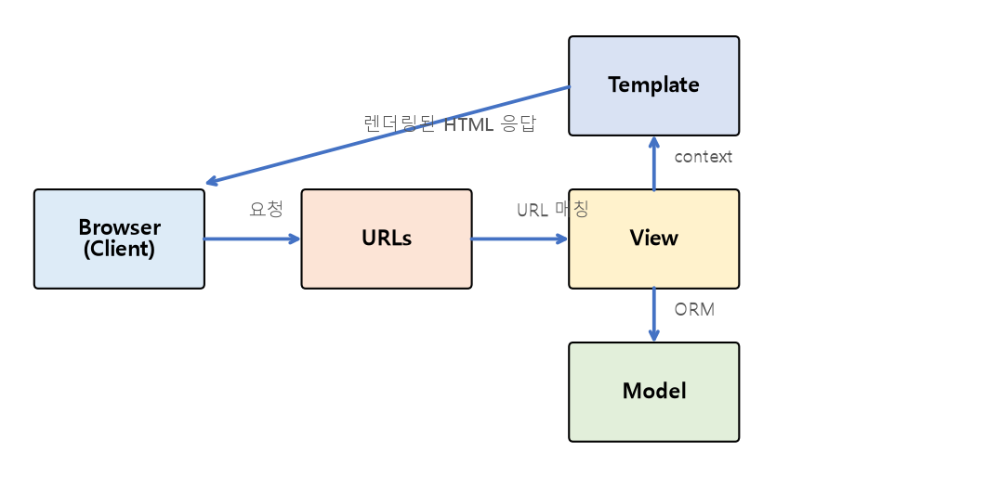

# Django Intro 정리

웹 애플리케이션의 개념과 프레임워크의 역할을 살펴보고, 파이썬 웹 프레임워크 **Django**의 기본 구조와 설계 패턴을 정리한 문서입니다.

---

## 1. Web Application

* **정적 웹(Static Web):** 서버에 저장된 파일을 그대로 응답하는 방식 (내용이 고정됨)
* **동적 웹(Dynamic Web):** 요청에 따라 서버가 데이터를 가공해 **매번 다른 응답**을 만들어내는 방식 (로그인 사용자별 화면, DB 조회 결과 등)
* Django는 동적 웹 애플리케이션을 만들기 위한 백엔드 프레임워크

---

## 2. Framework

### 프레임워크를 쓰는 이유

* 웹 서비스에는 라우팅, DB 처리, 보안, 템플릿 렌더링 등 **반복적으로 필요한 기능**이 많음
* 프레임워크는 이런 공통 기능들을 미리 구조화해서 제공해, 개발자가 **핵심 비즈니스 로직**에 집중할 수 있게 해줌
* **라이브러리 vs 프레임워크:** 라이브러리는 필요할 때 개발자가 호출해서 사용하지만, 프레임워크는 정해진 규칙(구조) 안에서 개발자의 코드가 호출됨 (제어의 역전, IoC)

---

## 3. 가상환경 (Virtual Environment)

* 프로젝트마다 사용하는 패키지 버전이 다를 수 있어, 시스템 전역이 아닌 **프로젝트별로 독립된 파이썬 환경**을 구성하는 것이 안전함

```bash
python -m venv venv           # 가상환경 생성
source venv/Scripts/activate    # 가상환경 활성화 (Windows Git Bash 기준)

pip install django              # 가상환경 안에 Django 설치
pip freeze > requirements.txt    # 설치된 패키지 목록 저장
pip install -r requirements.txt   # 저장된 목록으로 동일한 환경 재구성
```

---

## 4. Django 프로젝트

### 프로젝트 vs 앱(App)

* **프로젝트(Project):** 하나의 웹 서비스 전체 (설정, 배포 단위)
* **앱(App):** 프로젝트를 구성하는 기능 단위 모듈 (예: 게시판 앱, 회원 앱). 하나의 프로젝트는 여러 개의 앱으로 구성될 수 있음

```bash
django-admin startproject config .    # 프로젝트 생성
python manage.py startapp articles     # 앱 생성

python manage.py runserver               # 개발 서버 실행
```

### 기본 프로젝트 구조

```
config/
├── settings.py    # 프로젝트 전역 설정 (DB, 설치된 앱, 미들웨어 등)
├── urls.py         # 프로젝트 전체 URL 매핑의 시작점
└── wsgi.py          # 배포 시 사용하는 WSGI 진입점

articles/
├── models.py       # 데이터 모델 정의
├── views.py         # 요청 처리 로직
├── urls.py           # 앱 단위 URL 매핑
└── admin.py           # Admin 사이트에 모델 등록
```

* 앱을 만든 뒤에는 `settings.py`의 `INSTALLED_APPS`에 등록해야 프로젝트에서 인식됨

---

## 5. Django Design Pattern — MTV

Django는 잘 알려진 **MVC(Model-View-Controller)** 패턴을 변형한 **MTV(Model-Template-View)** 패턴을 따릅니다.

| MTV 구성 요소 | 역할 | (MVC와 비교) |
| --- | --- | --- |
| **Model** | 데이터베이스와 관련된 데이터 구조/로직 | Model과 동일 |
| **Template** | 사용자에게 보여질 화면(HTML) | View에 해당 |
| **View** | 요청을 처리하고 Model/Template을 연결하는 로직 | Controller에 해당 |



### 요청-응답 흐름

1. 브라우저가 특정 URL로 요청을 보냄
2. `urls.py`가 요청 URL에 맞는 **View 함수**를 찾아 연결
3. View에서 필요하면 **Model**을 통해 DB 데이터를 조회/가공
4. View가 데이터를 **Template**에 context로 전달해 HTML을 렌더링
5. 완성된 HTML을 브라우저에 응답

```python
# views.py
def index(request):
    articles = Article.objects.all()          # Model을 통한 데이터 조회
    context = {"articles": articles}
    return render(request, "index.html", context)   # Template 렌더링
```

---

## 핵심 요약
* Django는 동적 웹 애플리케이션을 만들기 위한 파이썬 프레임워크로, 반복적인 공통 기능을 미리 제공해 개발자가 비즈니스 로직에 집중할 수 있게 한다.
* 하나의 **프로젝트**는 여러 개의 **앱(App)** 으로 구성되며, 가상환경으로 프로젝트별 패키지 의존성을 독립적으로 관리한다.
* Django는 **MTV(Model-Template-View)** 패턴을 따르며, URL이 View를 찾고 View가 Model(데이터)과 Template(화면)을 연결해 최종 응답을 만든다.
