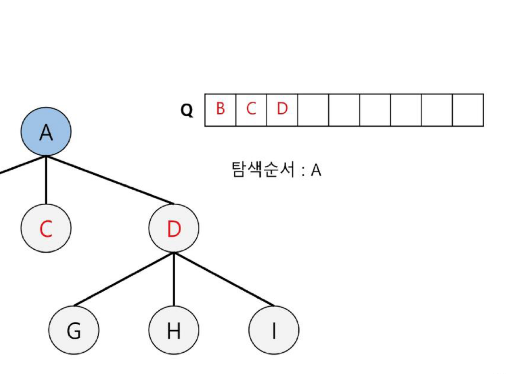
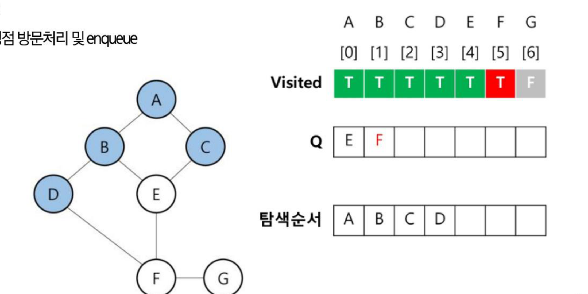

# SW문제해결기본 BFS 정리

트리 탐색의 또 다른 방법인 **BFS(너비 우선 탐색)**를 트리와 그래프 각각에 적용하는 동작 과정과 구현, 그리고 BFS 응용 문제인 **도로 이동시간**, **섬 찾기**를 정리한 문서입니다.

---

## 1. BFS - 트리

* 루트 노드의 **자식 노드들을 먼저 모두 차례로 방문**한 후에, 방문했던 자식 노드들을 기준으로 하여 다시 해당 노드의 자식 노드들을 차례로 방문하는 방식
* 인접한 노드들에 대해 탐색을 한 후, 차례로 다시 너비우선탐색을 진행해야 하므로, **선입선출 형태의 자료구조인 큐**를 활용함

```
BFS(v)
  큐 생성
  루트 v를 큐에 삽입
  while (큐가 비어 있지 않은 경우) {
    t ← 큐의 첫 번째 원소 취함
    t 방문
    for (t와 연결된 모든 간선에 대해) {
      u ← t의 자식노드
      u를 큐에 삽입
    }
  }
end BFS()
```

### BFS(트리) 동작 과정 예시
트리: `A - B, C, D` / `B - E, F` / `D - G, H, I`

1. 큐(Q)를 생성하고 루트 노드(A)를 enqueue
2. dequeue A → A의 자식 노드 enqueue → 탐색순서: `A`
3. dequeue B → B의 자식 노드 enqueue → 탐색순서: `A B`
4. dequeue C → C의 자식 노드 enqueue(없음) → 탐색순서: `A B C`
5. dequeue D → D의 자식 노드 enqueue → 탐색순서: `A B C D`
6. 이후 E, F, G, H, I를 차례로 dequeue(각 노드는 자식이 없음) → 최종 탐색순서: `A B C D E F G H I`



### BFS(트리) 알고리즘 코드

```python
from collections import deque

def bfs_tree(tree, root_node):
    queue = deque([root_node])
    result = []

    while queue:
        node = queue.popleft()
        result.append(node)
        if node not in tree: continue
        for child in tree[node]:
            queue.append(child)

    return result

tree = {'A': ['B', 'C', 'D'],
        'B': ['E', 'F'],
        'D': ['G', 'H', 'I']}

root_node = 'A'
result = bfs_tree(tree, root_node)
print(' '.join(result))
```

---

## 2. BFS(그래프)

* 탐색 시작점의 인접한 정점들을 모두 차례로 방문한 후에, 방문했던 정점을 시작점으로 하여 다시 인접한 정점들을 차례로 방문하는 방식
* 트리와 달리 그래프는 **싸이클이 존재**할 수 있으므로, 이미 방문한 정점을 다시 큐에 넣지 않도록 `visited` 체크가 반드시 필요하다.

### BFS(그래프) 동작 과정 예시
그래프: `A-B, A-C, B-D, B-E, C-E, D-F, E-F, F-G` (인접 리스트로 표현)

1. `Visited` 리스트 생성 및 `False`로 초기화, Q 생성, 시작 정점(A) 방문처리 및 enqueue
2. dequeue A → A의 인접 정점 방문처리 및 enqueue (`B, C`)
3. dequeue B → B의 인접 정점 방문처리 및 enqueue (`D, E`)
4. dequeue C → C의 인접 정점 확인(이미 방문된 E 제외, 추가 없음)
5. dequeue D → D의 인접 정점 방문처리 및 enqueue (`F`)



6. dequeue E → E의 인접 정점 확인(이미 방문된 F 제외, 추가 없음)
7. dequeue F → F의 인접 정점 방문처리 및 enqueue (`G`)
8. dequeue G → G의 인접 정점 없음 → Q가 비었으므로 탐색 종료

### BFS(그래프) 알고리즘 코드

```python
from collections import deque

graph = {
    'A': ['B', 'C'],
    'B': ['A', 'D', 'E'],
    'C': ['A', 'E'],
    'D': ['B', 'F'],
    'E': ['B', 'C', 'F'],
    'F': ['D', 'E', 'G'],
    'G': ['F']
}

def bfs(start):
    nodes = list(graph.keys())
    visited = [False] * len(nodes)
    queue = deque([start])
    result = []

    start_index = nodes.index(start)
    visited[start_index] = True

    while queue:
        vertex = queue.popleft()
        result.append(vertex)

        for neighbor in graph[vertex]:
            neighbor_index = nodes.index(neighbor)
            if not visited[neighbor_index]:
                queue.append(neighbor)
                visited[neighbor_index] = True

    return result

print("그래프 탐색 경로:", bfs('A'))
```

---

## 3. BFS 문제풀이 — 도로 이동시간

* `N x M` 크기의 리스트로 표현되는 도로 정보가 있다. (`2 ≤ N, M ≤ 100`)
* 이 정보에서 `1`은 이동할 수 있는 길을 나타내고, `0`은 이동할 수 없는 장애물을 나타낸다.
* 이러한 도로 정보가 주어졌을 때, `(1,1)`에서 출발하여 `(N,M)`의 위치로 이동할 때 최소의 이동 시간을 구하는 프로그램을 작성하시오.
* 하나의 길에서 다른 길로 이동할 때, 서로 인접한 길(상, 하, 좌, 우)로만 이동할 수 있고, 각 인접한 길로의 이동 시간은 1로 모두 같다.
* 아래 예에서는 `(1,1)`에서 출발하여 `(N,M)`의 위치로 이동하는데 **소요되는 최소시간은 14**이다.

```
1 0 1 1 1 1
1 0 1 0 1 0
1 0 1 0 1 1
1 1 1 0 1 1
```

* **접근 방법:** 시작점 `(1,1)`에서 BFS로 인접한(상하좌우) 이동 가능한 칸을 순서대로 방문하면서, 각 칸까지의 최소 이동 횟수를 함께 기록한다. BFS는 가까운 칸부터 순서대로 방문하므로, `(N,M)`에 처음 도달했을 때의 이동 횟수가 바로 최단 이동 시간이 된다. (그리드에서의 최단 경로를 구하는 BFS의 대표적인 활용 패턴)

---

## 4. BFS 문제풀이 — 섬 찾기

* 2D 격자에서 `1`은 땅을 나타내고, `0`은 물을 나타낸다.
* 섬은 땅이 상하좌우로 다른 셀과 하나 이상의 `1`로 이루어져 있다.
* 격자에서 상하좌우로 인접해 있는 땅들이 모여 하나의 섬을 이루며, 격자에서 섬의 개수를 찾으시오.

```
1 1 0 0 0
1 1 0 0 0
0 0 0 1 0
0 1 0 1 1
```

* 첫 번째 줄에 격자의 크기를 나타내는 정수 N과 M이 주어진다.(`1 ≤ N, M ≤ 100`) 다음 N개의 줄에 격자의 상태가 주어진다. 각 줄은 길이 M의 문자열이고, `1`은 땅, `0`은 물을 나타낸다.
* **접근 방법:** 격자를 순회하다가 아직 방문하지 않은 땅(`1`)을 만나면, 그 칸에서부터 BFS(또는 DFS)로 상하좌우로 연결된 모든 땅을 한 번에 방문 처리하고 섬의 개수를 1 증가시킨다. 이를 격자 전체에 대해 반복하면, BFS를 새로 시작한 횟수가 곧 섬의 개수가 된다. (그래프 문제의 "연결 요소 개수 구하기"와 동일한 패턴)

---

## 핵심 요약
* **BFS(너비 우선 탐색)**는 시작 노드의 인접 노드들을 먼저 모두 방문한 뒤, 그 다음 레벨의 노드들을 차례로 방문하는 방식으로, **큐(Queue)**를 이용해 구현한다(DFS가 스택/재귀를 쓰는 것과 대비된다).
* 트리는 싸이클이 없으므로 별도의 방문 체크 없이 자식을 그대로 enqueue하면 되지만, **그래프는 싸이클이 있을 수 있어 `visited` 배열로 중복 방문을 반드시 막아야 한다.**
* BFS는 **가까운 노드부터 순서대로 방문**하는 특성 때문에, 그리드나 그래프에서 **최단 경로(최소 이동 횟수)를 구하는 문제**(도로 이동시간)에 적합하다.
* 격자/그래프에서 **연결된 덩어리(연결 요소)의 개수**를 세는 문제(섬 찾기)는 방문하지 않은 지점마다 새로 BFS(또는 DFS)를 시작한 횟수를 세는 방식으로 푼다.
