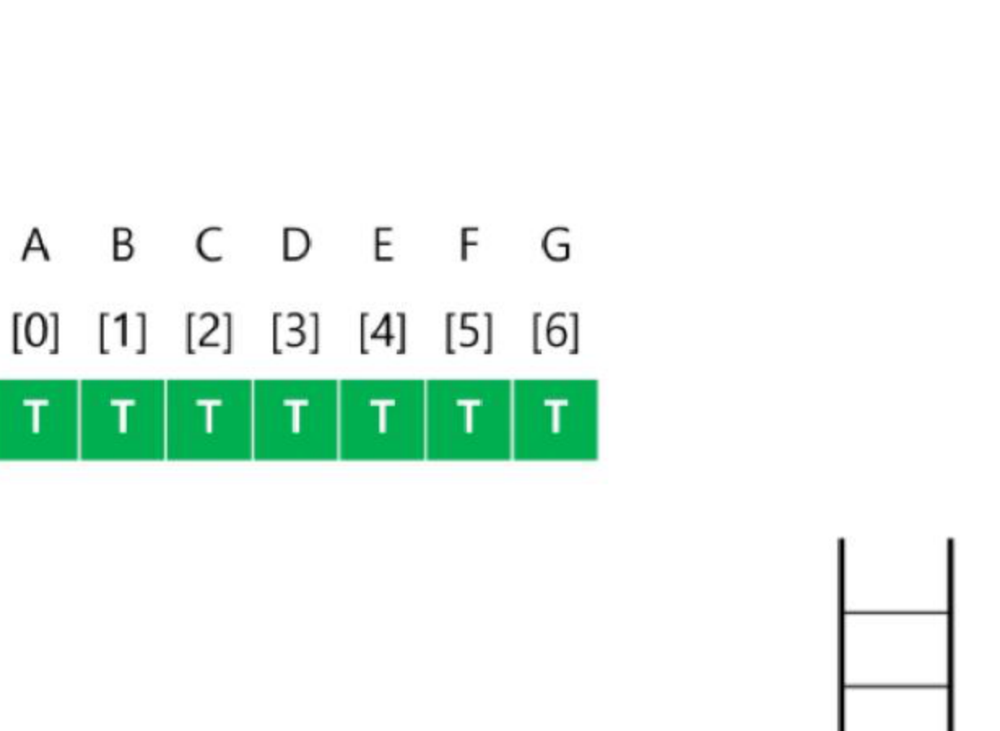
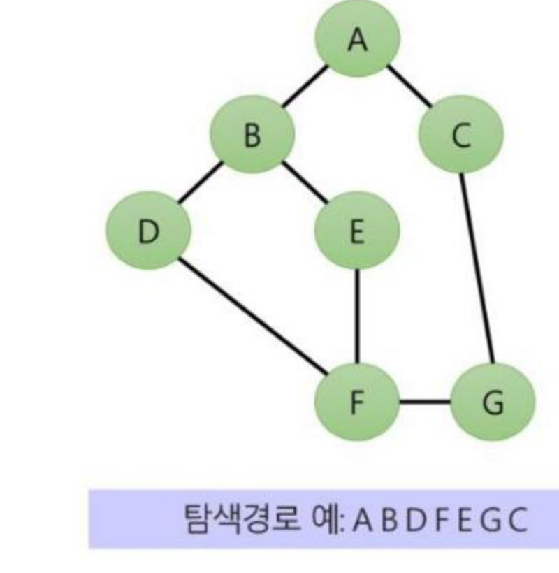

# SW문제해결기본 DFS 1 정리

트리보다 더 일반적인 비선형 자료구조인 **그래프(Graph)**의 개념·유형·표현 방법과, 그래프 탐색의 대표 기법인 **DFS(깊이 우선 탐색)**의 동작 과정과 구현을 정리한 문서입니다.

---

## 1. 그래프(Graph)

### 그래프의 개념
* 아이템(사물 또는 추상적 개념)들과 이들 사이의 연결 관계를 표현한다.
* 그래프는 **정점(Vertex)**들의 집합과 이들을 연결하는 **간선(Edge)**들의 집합으로 구성된 자료구조
  * **정점(Vertex):** 그래프의 구성요소로 하나의 연결점
  * **간선(Edge):** 두 정점을 연결하는 선
  * **차수(Degree):** 정점에 연결된 간선의 수
* 그래프 간선 수: `V`개의 정점을 가지는 그래프는 최대 `V * (V-1) / 2`간선이 가능하다. 예) 5개 정점이 있는 그래프의 최대 간선 수는 `5 * 4 / 2 = 10`개
* 선형 자료구조나 트리 자료구조로 표현하기 어려운 `N:M` 관계를 가지는 원소들을 표현하기에 용이하다.

### 그래프 유형
* 무방향 그래프(Undirected Graph) / 방향 그래프(Directed Graph) / 가중치 그래프(Weighted Graph) / 싸이클 없는 방향 그래프(DAG, Directed Acyclic Graph) / 트리(Tree)
* **완전 그래프:** 정점들에 대해 가능한 모든 간선들을 가진 그래프
* **부분 그래프:** 원래 그래프에서 일부의 정점이나 간선을 제외한 그래프
* 트리도 그래프이다. 각 노드는 최대 하나의 부모 노드가 존재할 수 있고, 각 노드는 자식 노드가 없거나 하나 이상이 존재할 수 있으며, 두 노드 사이에는 유일한 경로가 존재한다.

### 인접(Adjacency), 경로(Path), 싸이클(Cycle)
* **인접(Adjacency):** 두 개의 정점에 간선이 존재(연결됨)하면 서로 인접해 있다고 한다.
* **경로(Path):** 어떤 정점 A에서 시작하여 다른 정점 B로 끝나는 순회로 두 정점 사이를 잇는 간선들을 순서대로 나열한 것 (같은 정점을 거치지 않는 간선들의 sequence)
  * 경로 중 한 정점을 최대한 한번만 지나는 경로를 **단순 경로**라 한다.
* **싸이클(Cycle):** 경로의 시작 정점과 끝 정점이 같음. 시작한 정점에서 끝나는 경로. 많은 그래프 알고리즘들이 싸이클 여부에 따라 다르게 동작함

---

## 2. 그래프 표현

간선의 정보를 저장하는 방식은 메모리나 성능을 고려해서 결정한다.

### 인접 행렬(Adjacent Matrix)
* `V * V` 크기의 2차원 배열을 이용해서 간선 정보를 저장
* 두 정점을 연결하는 간선의 유무를 행렬로 표현: `V x V` 정방 행렬(행의 수와 열의 수가 같은 행렬), 행 번호와 열 번호는 그래프의 정점에 대응, 두 정점이 인접되어 있으면 1, 그렇지 않으면 0으로 표현
* 무향 그래프: `i`번째 행의 합 = `i`번째 열의 합 = `V_i`의 차수. 유향 그래프: 행의 합 = `V_i`의 진출 차수, 열의 합 = `V_i`의 진입 차수
* **장점:** 두 정점 사이에 간선이 있는지 확인하는 연산이 `O(1)`로 빠름, 구현이 단순, 정적 그래프에 적합
* **단점:** 많은 메모리를 차지함(공간 복잡도 `O(V^2)`), 간선 수를 확인하거나 인접한 정점을 나열하는 연산이 느림
* **사용하기 좋은 상황:** Dense Graph(밀집 그래프)에 적합, 두 정점 사이에 간선이 있는지 빠르게 확인해야 하는 경우

### 인접 리스트(Adjacent List)
* 각 정점마다 다른 정점으로 나가는 간선의 정보를 저장
* 각 정점에 대한 인접 정점들을 순차적으로 표현. 하나의 정점에 대한 인접 정점들을 각각 노드로 하는 연결 리스트로 저장
* **장점:** 필요한 공간만 사용하므로 공간 복잡도 `O(V+E)`, 인접한 정점을 나열하는 연산이 빠름
* **단점:** 두 정점 사이에 간선이 있는지 확인하는 연산이 느림(`O(V)`), 링크드리스트로 구현이 복잡
* **사용하기 좋은 상황:** Sparse Graph(희소 그래프)에 적합, 그래프가 동적으로 변하는 경우(정점과 간선이 자주 추가/삭제), 인접한 정점을 자주 순회해야 하는 경우

### 간선 리스트(Edge List)
* 두 정점에 대한 간선 그 자체를 객체로 표현하여 리스트로 저장
* 간선을 표현하는 두 정점의 정보를 나타냄(시작 정점, 끝 정점)
* **장점:** 필요한 간선만 저장하므로 공간 복잡도 `O(E)`, 간선을 직접 다루는 연산에 효율적
* **단점:** 두 정점 사이에 간선이 있는지 확인하는 연산이 느림(`O(E)`), 특정 정점에 인접한 정점을 찾는 연산이 느림(`O(E)`)
* **사용하기 좋은 상황:** 간선 중심 연산을 자주 수행해야 하는 경우(예: MST)

---

## 3. DFS(그래프) — 깊이 우선 탐색

* 비선형구조인 트리, 그래프의 각 노드(정점)를 중복되지 않게 전부 방문(visit)하는 것을 말하는데, 비선형구조는 선형 구조에서와 같이 선후 연결관계를 알 수 없다. ⇒ 특별한 방법이 필요하다.
* 두 가지 방법: **깊이우선탐색(Depth First Search, DFS)**, **너비우선탐색(Breadth First Search, BFS)**
* 시작 정점에서 출발하여 한 방향으로 갈 수 있는 경로가 있는 곳까지 깊이 탐색해 가다가 더 이상 갈 곳이 없게 되면, 가장 마지막에 만났던 갈림길 간선이 있는 정점으로 되돌아와서 다른 방향의 정점으로 탐색을 계속 반복하여 결국 모든 정점을 방문하는 순회방법

### DFS 동작 과정 예시
그래프: `A-B, A-C, B-D, B-E, C-F, E-F, F-G` (인접 리스트로 표현), 시작 정점 A

1. `visited` 리스트 생성 및 `False`로 초기화
2. `A` 방문 → 호출 스택에 `A` push → 방문하지 않은 인접 정점 `B`로 `DFS(B)`
3. `B` 방문 → 방문하지 않은 인접 정점 `D`로 `DFS(D)`
4. `D` 방문 → 인접 정점 없음 → 호출 스택의 이전(B)으로 되돌아감
5. `B`의 다음 인접 정점 `E`로 `DFS(E)`
6. `E` 방문 → 인접 정점 `F`로 `DFS(F)`
7. `F` 방문 → 인접 정점 `C`로 `DFS(C)`
8. `C` 방문 → 인접 정점 없음(이미 방문) → 이전 호출 스택으로 리턴(`DFS(E)→DFS(F)`)
9. `F`의 다음 인접 정점 `G`로 `DFS(G)`, `G` 방문 → 탐색 시작 정점의 모든 인접 정점을 모두 방문하여 탐색 종료



* 가장 마지막에 만났던 갈림길의 노드로 되돌아가서 다시 깊이 우선 탐색을 반복해야 하므로 **재귀적으로 구현**하거나 **후입선출 구조의 스택**을 사용해서 구현한다.

### DFS(그래프) 알고리즘 코드 구현

```python
N = 5
adj_matrix = [
    [0, 1, 1, 0, 0],
    [1, 0, 0, 1, 1],
    [1, 0, 0, 0, 1],
    [0, 1, 0, 0, 1],
    [0, 1, 1, 1, 0]
]
visited = [False] * N

# current: 탐색 정점 / adjMatrix: 인접 행렬 / visited: 방문 체크 리스트
def dfs(current, adj_matrix, visited):
    visited[current] = True
    for i in range(len(adj_matrix)):
        if adj_matrix[current][i] and not visited[i]:
            dfs(i, adj_matrix, visited)

for i in range(N):
    if visited[i]: continue
    dfs(0, adj_matrix, visited)
```

### 연습문제: DFS
* 연결되어 있는 두 개의 정점 사이의 간선을 순서대로 나열해놓은 정보(`7 8 / 0 1 / 0 2 / 1 3 / 1 4 / 3 5 / 4 5 / 5 6 / 2 6`)가 주어질 때, 모든 정점을 DFS하여 깊이 우선 탐색 경로를 출력하기 (인접 리스트로 접근해서 풀 것, 시작 정점은 `A`)



---

## 4. 문제풀이 — 7465. 창용 마을 무리의 개수

* 창용 마을에는 N명의 사람이 살고 있다. 사람은 편의상 1번부터 N번 사람까지 번호가 붙여져 있다고 가정한다.
* 두 사람은 서로 알고 있는 관계일 수도 아닐 수도 있다.
* 두 사람이 서로 아는 관계이거나, 몇 사람을 거쳐서 알 수 있는 관계라면, 이러한 사람들을 모두 다 묶어서 하나의 무리라고 한다.
* 창용 마을에 몇 개의 무리가 존재하는지 계산하는 프로그램을 작성한다.
* 사람들을 정점, 아는 관계를 간선으로 하는 그래프로 표현한 뒤, 방문하지 않은 정점을 시작으로 DFS를 반복 수행하면서(연결된 정점을 모두 방문 처리) DFS를 새로 시작한 횟수를 세면, 그 값이 곧 서로 연결된 무리(연결 요소, connected component)의 개수가 된다.

---

## 핵심 요약
* **그래프**는 정점(Vertex)과 간선(Edge)의 집합으로 이루어진 `N:M` 관계 표현에 적합한 비선형 자료구조로, 무방향/방향/가중치/DAG 등 다양한 유형이 있다.
* 그래프는 **인접 행렬**(`O(1)` 간선 확인, `O(V^2)` 공간, 밀집 그래프에 적합), **인접 리스트**(`O(V+E)` 공간, 인접 정점 순회가 빠름, 희소 그래프에 적합), **간선 리스트**(간선 중심 연산에 적합) 중 상황에 맞게 골라 표현한다.
* **DFS**는 한 방향으로 갈 수 있는 데까지 깊이 탐색하다가 막다른 곳에 이르면 가장 최근의 갈림길로 되돌아가 다른 방향을 탐색하는 방식으로, **재귀** 또는 **스택**으로 구현하며 방문 여부를 `visited` 배열로 관리한다.
* **7465. 창용 마을 무리의 개수**처럼, 방문하지 않은 정점마다 새로 DFS를 시작한 횟수를 세면 그래프에서 서로 연결된 무리(연결 요소)의 개수를 구할 수 있다.
