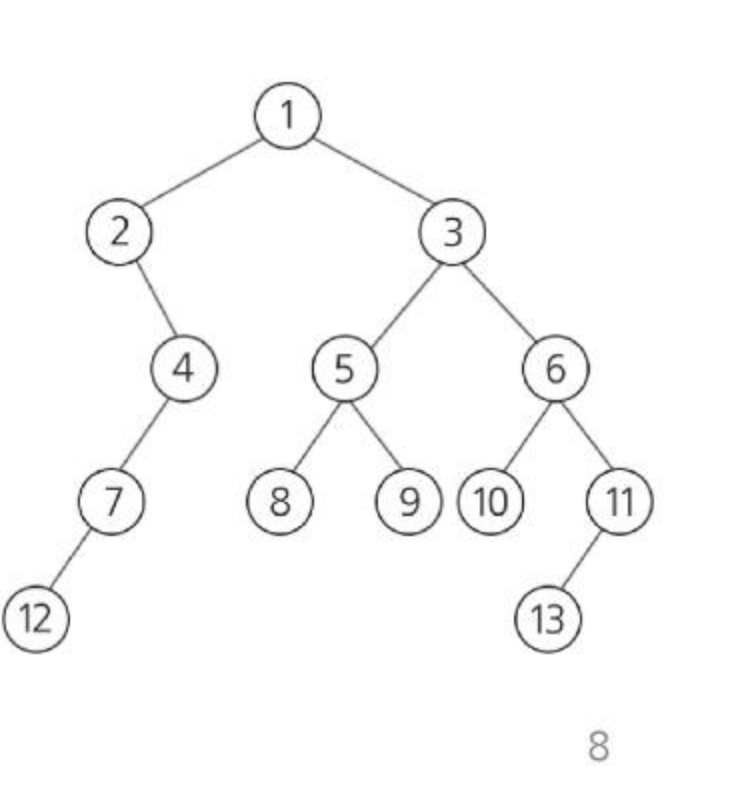
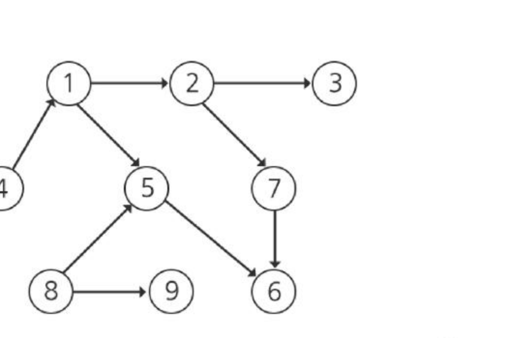

# SW문제해결기본 DFS 2 정리

DFS(깊이 우선 탐색)를 트리·그래프 문제에 실제로 적용해보는 연습문제 3개(**1486. 장훈이의 높은 선반**, **1248. 공통 조상**, **1267. 작업 순서**)를 정리한 문서입니다.

---

## 1. 1486. 장훈이의 높은 선반

* 서점에는 높이가 B인 선반이 하나 있는데 장훈이는 키가 매우 크기 때문에 선반 위의 물건을 자유롭게 사용할 수 있다.
* 서점에 있는 N명의 점원들이 장훈이가 선반 위에 올려놓은 물건을 사용해야 한다.
* 각 점원의 키는 `H_i`, 점원들이 탑을 쌓아서 선반 위의 물건을 사용하기로 하였다.
* 점원들이 쌓는 탑은 점원 명 이상으로 이루어져 있다.
* 탑의 높이는 점원이 1명일 경우, 그 점원의 키와 같고, 2명 이상일 경우 탑을 만든 모든 점원의 키의 합과 같다.
* 탑의 높이가 B 이상인 경우 선반 위의 물건을 사용할 수 있는데, 탑의 높이가 높을수록 더 위험하므로 **높이가 B 이상인 탑 중에서 높이가 가장 낮은 탑**을 알아내려고 한다.
* 점원들의 부분집합(조합)을 모두 만들어 그 합이 B 이상이 되는 조합 중 합이 최소인 값을 찾는, **부분집합 완전 탐색**으로 접근할 수 있는 문제이다.

---

## 2. 1248. 공통 조상

* 이진 트리에서 임의의 두 정점에 가장 가까운 공통 조상을 찾고, 그 정점을 루트로 하는 서브 트리의 크기를 알아내는 프로그램을 작성하라.
* 예를 들어, 예시의 이진 트리에서 정점 8과 13의 공통 조상은 정점 3과 1 두 개가 있다. 이 중 8, 13에 가장 가까운 것은 정점 3이고, 정점 3을 루트로 하는 서브 트리의 크기(서브 트리에 포함된 정점의 수)는 8이다.

* 가장 첫 번째 줄에 테스트케이스 수가 주어진다.
* 각 케이스의 첫 번째 줄에는 정점의 개수 V와 간선의 개수 E, 공통 조상을 찾는 두 개의 정점 번호가 주어진다.
* 각 케이스의 두 번째 줄에는 E개 간선이 나열된다. 간선은 항상 '부모 자식' 순서로 표기된다.
* **접근 방법:** 루트에서부터 DFS로 각 정점의 부모(parent)를 기록해 두고, 두 정점에서 각각 루트까지 거슬러 올라가는 경로(조상 리스트)를 구한 뒤, 두 경로에 공통으로 포함되면서 가장 먼저(정점에 가장 가까이) 만나는 정점을 공통 조상으로 찾는다. 이후 그 정점을 루트로 다시 DFS를 수행하며 방문한 정점 수를 세면 서브 트리의 크기를 구할 수 있다.

---

## 3. 1267. 작업 순서

* 해야 할 V개의 작업이 있다. 이들 중에 어떤 작업은 특정 작업이 끝나야 시작할 수 있으며, 이를 **선행 관계**라 하자.
* 이런 작업의 선행 관계를 나타낸 그래프가 주어진다.
* 이 그래프에서 각 작업은 하나씩의 정점으로 표시되고 선행 관계는 방향성을 가진 간선으로 표현된다.
* **단, 이 그래프에서 사이클은 존재하지 않는다.** (DAG, Directed Acyclic Graph)
* V개의 작업과 이들 간의 선행 관계가 주어질 때, 일을 끝낼 수 있는 작업 순서를 찾는 프로그램을 작성하라.
* 각 케이스의 첫 번째 줄에는 그래프의 정점의 개수와 간선의 개수가 주어지고, 그 다음 줄에는 E개의 간선이 나열된다. 간선은 간선을 이루는 두 정점으로 표기된다.

* 이 문제는 **위상 정렬(Topological Sort)** 문제로, 선행 관계(방향 간선)를 모두 만족하도록 정점들을 순서대로 나열하는 문제이다. DFS로 각 정점을 방문하며, 더 이상 갈 곳이 없어 되돌아갈 때(모든 자식을 방문한 후) 해당 정점을 결과 리스트의 앞쪽에 삽입하는 방식(후위 순회 결과를 뒤집는 방식)으로 위상 정렬 순서를 구할 수 있다.

---

## 핵심 요약
* **1486. 장훈이의 높은 선반**은 부분집합(조합)을 완전 탐색하여 합이 조건(B 이상)을 만족하는 최소값을 찾는 문제로, 부분집합 탐색 기법을 복습하는 문제다.
* **1248. 공통 조상**은 트리에서 각 정점까지의 부모 경로를 DFS로 구한 뒤, 두 정점의 조상 경로가 겹치는 가장 가까운 지점을 찾고, 그 지점을 루트로 다시 DFS하여 서브 트리 크기를 구하는 문제다.
* **1267. 작업 순서**는 사이클이 없는 방향 그래프(DAG)에서 선행 관계를 만족하는 순서를 찾는 **위상 정렬** 문제로, DFS의 방문 종료 순서를 거꾸로 뒤집으면 올바른 작업 순서를 얻을 수 있다.
* 세 문제 모두 트리/그래프 문제이지만 결국 **DFS로 정점을 빠짐없이 방문하면서 필요한 정보(부모, 방문 순서, 서브트리 크기 등)를 함께 기록**하는 것이 핵심 풀이 전략이다.
