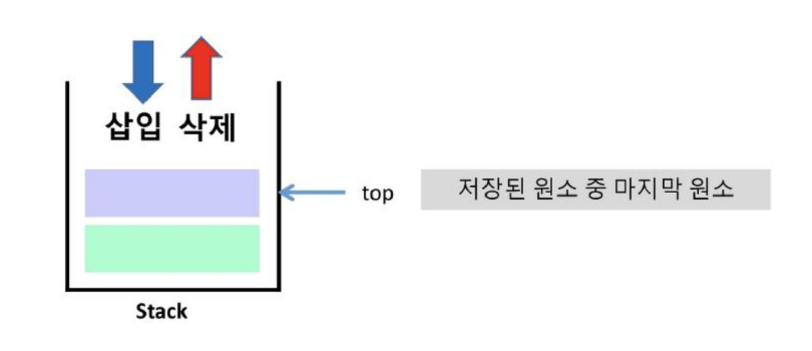
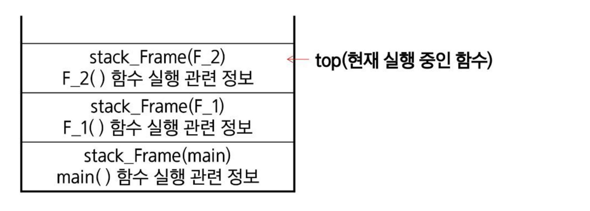

# SW문제해결기본 Stack 1 정리

자료구조 **스택(Stack)**의 구조와 작동원리, 클래스 기반 스택 구현(push/pop/isEmpty/peek), 그리고 스택의 응용 사례인 **괄호 검사**와 **function call(함수 호출 스택)**을 정리한 문서입니다.

---

## 1. 스택의 구조와 작동원리

### 스택(stack)이란?
* 물건을 쌓아 올리듯 자료를 쌓아 올린 형태의 자료구조이다.
* 스택에 저장된 자료는 선형 구조를 갖는다.
  * **선형구조:** 자료 간의 관계가 1대1의 관계를 갖는다.
  * **비선형구조:** 자료 간의 관계가 1대다의 관계를 갖는다.(예: 트리)
* 스택에 자료를 삽입하거나 스택에서 자료를 꺼낼 수 있다.
* 뒤로 가기나 함수 호출에서 사용되는 자료구조이다.
* **후입선출 구조(LIFO, Last-In First-Out):** 마지막에 삽입한 자료를 가장 먼저 꺼낸다.
  * 예: 스택에 1, 2, 3 순으로 자료를 삽입하면 꺼낼 땐 3, 2, 1순으로 꺼낼 수 있다.

### 스택의 주요 연산
* **Push:** (삽입) 저장소에 자료를 저장한다.
* **Pop:** (삭제) 저장소에서 자료를 꺼낸다. 꺼낸 자료는 자료의 역순으로 꺼낸다.
* **IsEmpty:** 스택이 공백인지 확인한다.
* **Peek:** 스택의 top에 있는 자료를 **반환**한다.



### 스택의 삽입/삭제 과정
빈 스택에 원소 A, B, C를 차례로 삽입 후 한번 삭제하는 연산과정
```
push A → push B → push C → pop
[A]      [B]       [C]←top   [ ]
 top=A   [A]        [B]      [B]←top
         top=B      [A]      [A]
                     top=C
```

---

## 2. 스택 구현

### 스택 구현 — push
* 메서드를 통한 구현
* `append` 메서드를 통해 리스트의 마지막에 데이터를 삽입

```python
stack = []

def push(item):
    stack.append(item)
```

* 클래스를 이용해서 구조체를 정의하고, top 포인터를 활용해서 구현

```python
class Stack:
    def __init__(self, capacity=10):
        self.capacity = capacity
        self.items = [None] * capacity
        self.top = -1

    def is_full(self):
        return self.top == self.capacity - 1

    def push(self, item):
        if self.is_full():
            raise IndexError("Stack is full")
        self.top += 1
        self.items[self.top] = item
```

### 스택 구현 — pop
* 메서드를 통한 구현
* `pop` 메서드를 통해 리스트의 마지막에 데이터를 추출

```python
stack = []

def pop():
    if len(stack) == 0:
        print("데이터가 없습니다.")
        return
    return stack.pop()
```

* 클래스를 이용해서 구조체를 정의하고, top 포인터를 활용해서 구현

```python
class Stack:
    def is_empty(self):
        return self.top == -1

    def pop(self):
        if self.is_empty():
            raise IndexError("Stack is empty")
        item = self.items[self.top]
        self.items[self.top] = None
        self.top -= 1
        return item
```

### 스택 구현 — IsEmpty
```python
def is_empty(self):
    return self.top == -1
```

### 스택 구현 — Peek
```python
def peek(self):
    if self.is_empty():
        raise IndexError("Stack is empty")
    return self.items[self.top]
```

---

## 3. 스택 연습문제

* 스택을 구현해 봅니다.
* 구현한 스택을 이용하여 3개의 데이터를 스택에 저장하고 다시 3번 꺼내서 출력해 봅니다.

---

## 4. 스택 응용 — 괄호 검사

### 괄호의 종류
* 대괄호(`[`, `]`), 중괄호(`{`, `}`), 소괄호(`(`, `)`)

### 조건
1. 왼쪽 괄호의 개수와 오른쪽 괄호의 개수가 같아야 한다.
2. 같은 괄호에서 왼쪽 괄호는 오른쪽 괄호보다 먼저 나와야 한다.
3. 괄호 사이에는 포함 관계만 존재한다.

### 잘못된 괄호 사용의 예
* `(a(b)`
* `a(b)c)`
* `a)b(c)d)e)f)`

### 검사 방법
* 문자열에 있는 괄호는 차례대로 조사하면서 왼쪽 괄호를 만나면 스택에 삽입하고, 오른쪽 괄호를 만나면 스택에서 top 괄호를 삭제한 후 오른쪽 괄호와 짝이 맞는지를 검사한다.
* 이때 스택이 비어 있으면 조건1 또는 조건2에 위배되고, 괄호의 짝이 맞지 않으면 조건2에 위배된다.
* 마지막 괄호까지 조사한 후에도 스택에 괄호가 남아 있으면 조건1에 위배된다.

```
if(  (  i==0  )  &&  (  j==0  )
     ↑ push       ↑ push
     ↓ pop 하여    ↓ pop 하여
     비교          비교
```
* 오류1: 괄호 수식이 끝났는데 스택에 괄호가 남아 있음 → 조건 위배

### 괄호의 짝을 검사하는 프로그램을 작성해봅시다.
* 작성한 프로그램으로 다음 괄호 사용을 검사해 봅시다.

```
()()(())            # 정상
((()((()()(()()))))) # 검사 대상
```

---

## 5. 스택 응용 — function call

### Function call
* 프로그램에서의 함수 호출과 복귀에 따른 수행 순서를 관리
* 가장 마지막에 호출된 함수가 가장 먼저 실행을 완료하고 복귀하는 후입선출 구조이므로, 후입선출 구조의 스택을 이용하여 수행순서 관리

```
main() → ①  ②함수호출→ F_1() → ③  ④함수호출→ F_2() → ⑤
         ⑨복귀    ←              ⑧복귀    ←         (실행)
end main()                    ⑦        end F_1()   ⑥복귀
                            F_2()→ end F_2()
```

### 함수 호출이 발생하면
* 호출된 함수 수행에 필요한 지역변수, 매개변수 및 수행 후 복귀할 주소 등의 정보를 스택 프레임(stack frame)에 저장하여 시스템 스택에 삽입



### 함수의 실행이 끝나면
* 시스템 스택의 top 원소(스택 프레임)를 삭제(pop)하면서 프레임에 저장되어 있던 복귀주소를 확인하고 복귀
* 함수 호출과 복귀에 따라 이 과정을 반복하여 전체 프로그램 수행이 종료되면 시스템 스택은 공백 스택이 된다.

### 함수 호출과 복귀에 따른 전체 프로그램의 수행 순서
```
main() → ① → F_1() → ③ → F_2() → ⑤(실행)
  ⑨복귀 ←        ⑧복귀 ←        (F_2 실행)
end main()      ⑦   end F_1()  ⑥복귀
              F_2()

stack_Frame(F_2)     ← top(현재 실행 중인 함수)
stack_Frame(F_1)
stack_Frame(main)
```

---

## 핵심 요약
* **스택(Stack)**은 **후입선출(LIFO)** 구조의 선형 자료구조로, `push`(삽입), `pop`(삭제), `isEmpty`(공백 확인), `peek`(top 값 조회) 연산을 가진다.
* 스택은 리스트의 `append`/`pop` 메서드로 간단히 구현하거나, `top` 포인터와 고정 크기 배열을 활용한 클래스로 직접 구현할 수 있으며, `is_full`/`is_empty`로 경계를 체크해야 한다.
* **괄호 검사**는 왼쪽 괄호를 만나면 push, 오른쪽 괄호를 만나면 pop하여 짝이 맞는지 확인하는 스택의 대표적인 응용이며, 검사 도중 스택이 비어있거나 검사 종료 후 스택에 괄호가 남아있으면 오류다.
* **함수 호출(function call)**은 호출될 때마다 지역변수·매개변수·복귀 주소 등을 담은 **스택 프레임**을 시스템 스택에 push하고, 함수 실행이 끝나면 pop하여 복귀 주소로 돌아가는 방식으로, 후입선출 구조가 함수 호출/복귀 순서를 자연스럽게 관리한다.
