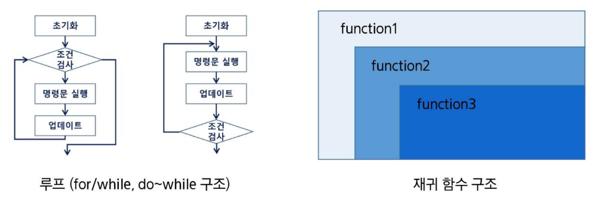
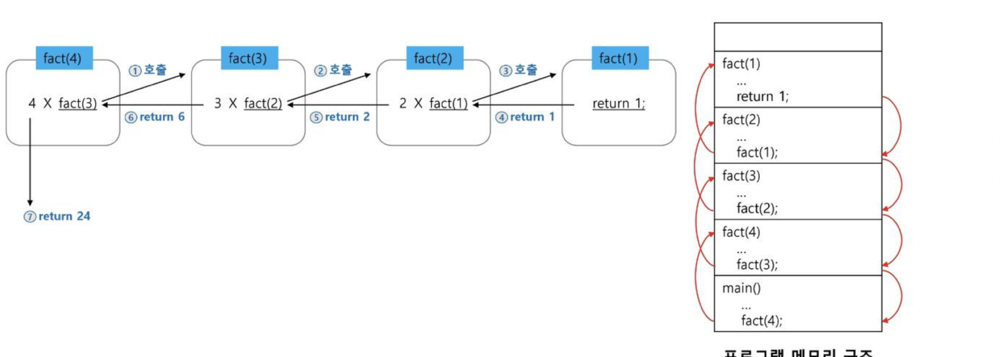

# SW문제해결기본 Stack 2 정리

스택을 활용한 **계산기(중위 표기법 → 후위 표기법 변환, 후위 표기법 계산)** 구현과, **재귀 호출(recursion)**의 개념·특징·대표 예제(팩토리얼, 피보나치 수열)를 정리한 문서입니다.

---

## 1. 계산기 1 — 중위 표기법과 후위 표기법

### 표기법의 종류
* **중위 표기법(infix notation):** 연산자를 피연산자의 가운데 표기하는 방법. 예) `A+B`
* **후위 표기법(postfix notation):** 연산자를 피연산자 뒤에 표기하는 방법. 예) `AB+`

### 문자열 수식 계산의 일반적 방법
1. **step1.** 중위 표기법의 수식을 후위 표기법으로 변경한다. (스택 이용)
2. **step2.** 후위 표기법의 수식을 스택을 이용하여 계산한다.

### step1 — 중위 → 후위 변환 알고리즘 (스택 이용)
입력 받은 중위 표기식에서 토큰을 하나씩 읽으며:
1. 토큰이 피연산자이면 바로 출력한다.
2. 토큰이 연산자(괄호 포함)일 때
   * 우선순위: 토큰 > 스택의 top에 저장되어 있는 연산자 ⇒ 스택에 push
   * 우선순위: 토큰 ≤ 스택의 top에 저장되어 있는 연산자 ⇒ 스택 top의 연산자를 토큰의 우선순위보다 작아질 때까지 스택에서 pop 한 후 토큰의 연산자를 push
   * 만약 top에 연산자가 없으면 push한다.
3. 토큰이 닫는 괄호 `)`이면 스택 top에 여는 괄호 `(`가 올 때까지 pop 연산을 수행하고 pop 한 연산자를 출력한다. (여는 괄호를 만나면 pop만 하고 출력하지는 않는다)
4. 중위 표기식에 더 읽을 것이 없다면 중지하고, 더 읽을 것이 있다면 1부터 다시 반복한다.
5. 스택에 남아 있는 연산자를 모두 pop하여 출력한다.
   * 스택 밖의 왼쪽 괄호는 우선 순위가 가장 높으며, 스택 안의 왼쪽 괄호는 우선 순위가 가장 낮다.

**연산자 우선순위:** `)` < `*, /` < `+, -` < `(`

**예) `(6+5*(2-8)/2)` → `6 5 2 8 - * 2 / +`**
* 토큰을 하나씩 읽어 피연산자는 바로 출력하고, 연산자·괄호는 위 규칙에 따라 스택에 push/pop하면서 후위 표기식을 완성한다.

### step2 — 후위 표기법의 수식을 스택으로 계산하기
1. 피연산자를 만나면 스택에 push 한다.
2. 연산자를 만나면 필요한 만큼(2개)의 피연산자를 스택에서 pop하여 연산하고, 연산 결과를 다시 스택에 push 한다.
3. 수식이 끝나면, 마지막으로 스택을 pop하여 출력한다.

**예) `6 5 2 8 - * 2 / +` 계산**
* `2 - 8 = -6` → `-6 * 5 = -30` → `-30 / 2 = -15` → `6 + (-15) = -9` → **결과 -9**

---

## 2. 재귀 호출(Recursion)

### 반복과 재귀
* 반복과 재귀는 유사한 작업을 수행할 수 있다.
* **반복:** 수행하는 작업이 완료될 때까지 반복 (for/while, do~while 구조)
* **재귀:** 주어진 문제의 해를 구하기 위해 동일하면서 더 작은 문제의 해를 이용하는 방법 → 재귀 함수로 구현



### 재귀 함수란?
* 함수 내부에서 직접 혹은 간접적으로 **자기 자신을 호출**하는 함수
* 일반적으로 재귀 정의를 이용해서 재귀 함수를 구현하며, **기본 부분(basis part)**과 **유도 부분(inductive part)**으로 구성된다.
* 재귀적 프로그램을 작성하는 것은 반복 구조에 비해 간결하고 이해하기 쉽지만, 재귀에 익숙하지 않은 개발자는 어렵다고 느낀다.
* 함수 호출은 프로그램 메모리 구조에서 **스택**을 사용하므로, 재귀 호출은 반복적인 스택의 사용을 의미하며 메모리 및 속도에서 성능저하가 발생할 수 있다.

### 재귀 함수를 연습하기 전 알아야 하는 함수의 특징
* A에서 B에 해당하는 함수를 호출할 때, `immutable`(int, str, tuple, …) 타입의 객체를 인자로 전달하면 **값만 복사**가 된다. (Pass by Value)
* `mutable`(list, dict, set, …) 타입을 건네는 경우는 **원본 객체도 함께 변경**된다. (Pass by reference)
* 함수가 끝나면 Main으로 돌아오는 것이 아니라 **해당 함수를 호출했던 곳으로 돌아온다.**

---

## 3. 팩토리얼(Factorial)

### n! 의 정의
```
n! = n x (n-1)!
(n-1)! = (n-1) x (n-2)!
(n-2)! = (n-2) x (n-3)!
...
2! = 2 x 1!
1! = 1
```
⇒ 마지막에 구한 하위 값을 이용하여 상위 값을 구하는 작업을 반복하는 것!

### 재귀적 정의
* Basis Rule: `N <= 1` 이면 `N! = 1`
* Inductive Rule: `N > 1` 이면 `N! = N * (N-1)!`

```python
def factorial(n):
    if n <= 1:              # Basis Rule
        return 1
    else:
        return n * factorial(n - 1)   # Inductive Rule
```

### Factorial(4)의 실행 과정
호출은 `fact(4) → fact(3) → fact(2) → fact(1)` 순으로 깊어지고, `fact(1)`이 `1`을 반환하면 거꾸로 `return 1 → return 2 → return 6 → return 24` 순으로 복귀한다. 이 과정은 프로그램 메모리(콜 스택)에 `fact(1)~fact(4)`, `main()` 순으로 스택 프레임이 쌓였다가 pop되는 것과 동일하다.



---

## 4. 피보나치 수열(Fibonacci)

* 이전의 두 수의 합을 다음 항으로 하는 수열: `0, 1, 1, 2, 3, 5, 8, 13, …`
* 피보나치 수열의 i번째 값을 계산하는 함수 F를 정의하면 다음과 같다.
  * `F(0) = 0`, `F(1) = 1`
  * `F(i) = F(i-1) + F(i-2)`, `i >= 2`
* 위의 정의로부터 피보나치 수열의 i번째 항을 반환하는 함수를 재귀 함수로 구현할 수 있다.

```python
def fibonacci(n):
    if n == 0:
        return 0
    elif n == 1:
        return 1
    else:
        return fibonacci(n - 1) + fibonacci(n - 2)
```

---

## 핵심 요약
* **계산기 구현**은 (1) 중위 표기법을 후위 표기법으로 바꾸는 단계와 (2) 후위 표기법을 스택으로 계산하는 단계, 두 단계로 나뉘며 둘 다 스택의 push/pop 규칙으로 처리된다.
* 중위→후위 변환 시 연산자는 **우선순위 비교**를 통해 스택에 push/pop되고, 괄호는 `(`를 만나면 push, `)`를 만나면 `(`가 나올 때까지 pop하여 우선순위를 강제로 정리하는 역할을 한다.
* **재귀 함수**는 자기 자신을 호출하는 함수로, 기본 부분(종료 조건)과 유도 부분(자기 호출)으로 구성되며, 내부적으로 시스템(콜) 스택을 사용하므로 반복문보다 메모리·속도 면에서 불리할 수 있다.
* **팩토리얼**과 **피보나치 수열**은 재귀의 대표 예제로, 팩토리얼은 `n * factorial(n-1)`, 피보나치는 `fibonacci(n-1) + fibonacci(n-2)` 형태의 재귀 관계식으로 구현한다.
