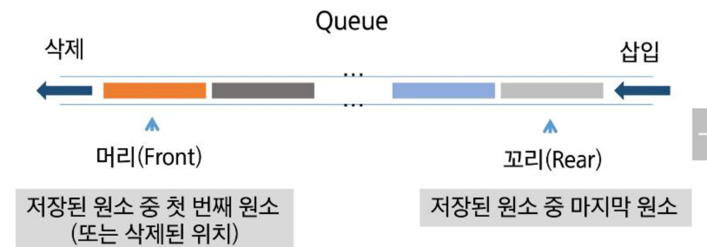
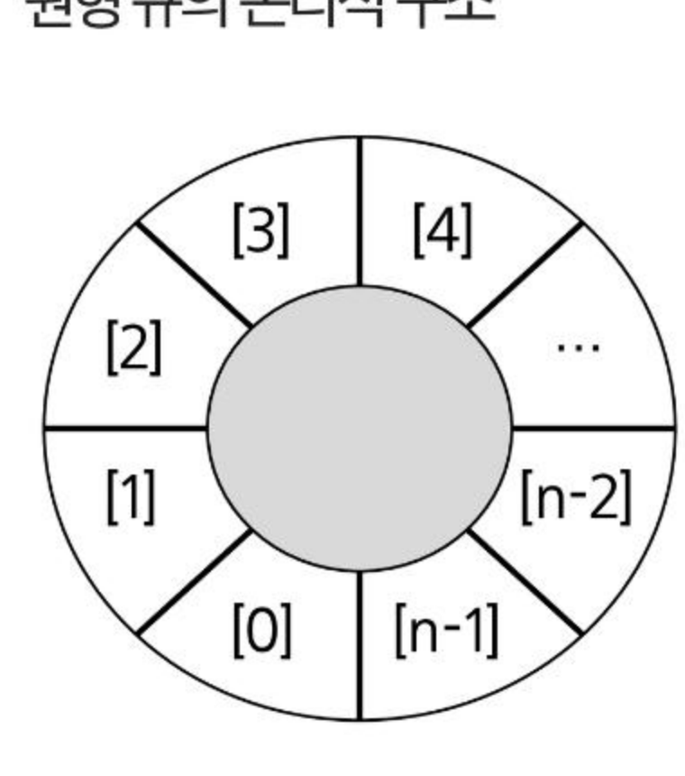

# SW문제해결기본 queue 정리

자료구조 **큐(Queue)**의 구조와 작동원리, 리스트/클래스 기반 큐 구현, 큐의 응용(버퍼, 마이쮸 나눠주기 시뮬레이션), 그리고 큐의 한계를 보완하는 **원형 큐(Circular Queue)**를 정리한 문서입니다.

---

## 1. 큐의 구조와 작동원리

### 큐(queue)란?
* 스택과 마찬가지로 삽입과 삭제의 위치가 제한적인 자료구조
  * 큐의 뒤에서는 삽입만 하고, 큐의 앞에서는 삭제만 이루어지는 구조
* **선입선출(FIFO, First In First Out):** 큐에 삽입한 순서대로 원소가 저장되어, 가장 먼저 삽입(First In)된 원소는 가장 먼저 삭제(First Out)된다.
* 예: 서비스 대기행렬(입장 순서대로 삽입, 도착한 순서대로 삭제)

### 큐의 주요 연산
* **EnQueue:** 큐의 뒤쪽에 원소를 삽입하는 연산
* **Dequeue:** 큐의 앞쪽에서 원소를 삭제하고 반환하는 연산
* **IsEmpty:** 큐가 공백상태인지를 확인하는 연산
* **IsFull:** 큐가 포화상태인지를 확인하는 연산
* **peek:** 큐의 앞쪽에서 원소를 삭제 없이 반환하는 연산



### 큐의 삽입/삭제 과정 (front, rear 포인터)
* `front`: 저장된 원소 중 첫 번째 원소(또는 삭제된 위치)를 가리킴
* `rear`: 저장된 원소 중 마지막 원소를 가리킴
* 공백 큐 생성 시 `front = rear = -1`
* `enQueue(A)` → rear가 한 칸 이동하며 A 저장 → `enQueue(B)` → rear가 다시 이동하며 B 저장
* `deQueue()` → front가 한 칸 이동하며 그 위치의 원소를 반환/삭제

---

## 2. 큐 구현

### enqueue
* 메서드를 통한 구현: `append` 메서드로 리스트의 마지막에 데이터를 삽입

```python
queue = []

def enqueue(item):
    queue.append(item)
```

* 클래스를 이용해서 구조체를 정의하고, front·rear 포인터를 활용해서 구현

```python
class Queue:
    def __init__(self, capacity=10):
        self.capacity = capacity
        self.items = [None] * capacity
        self.front = -1
        self.rear = -1

    def is_full(self):
        return self.rear == self.capacity - 1

    def enqueue(self, item):
        if self.is_full():
            raise IndexError("Queue is full")
        self.rear += 1
        self.items[self.rear] = item
```

### dequeue
* 메서드를 통한 구현: `pop(0)` 메서드로 리스트의 처음 데이터를 추출

```python
queue = []

def dequeue():
    if len(queue) == 0:
        print("데이터가 없습니다.")
        return
    return queue.pop(0)
```

* 클래스를 이용한 구현

```python
class Queue:
    def is_empty(self):
        return self.front == self.rear

    def dequeue(self):
        if self.is_empty():
            raise IndexError("Queue is empty")
        self.front += 1
        item = self.items[self.front]
        self.items[self.front] = None
        return item
```

### IsEmpty / IsFull / Peek

```python
def is_empty(self):
    return self.front == self.rear

def is_full(self):
    return self.rear == self.capacity - 1

def peek(self):
    if self.is_empty():
        raise IndexError("Queue is empty")
    return self.items[self.front + 1]
```

---

## 3. 큐 응용 — 버퍼(Buffer)

* 데이터를 한 곳에서 다른 한 곳으로 전송하는 동안 일시적으로 그 데이터를 보관하는 메모리의 영역
* 버퍼는 일반적으로 입출력 및 네트워크와 관련된 기능에서 이용된다.
* 순서대로 입력/출력/전달되어야 하므로 FIFO 방식의 자료구조인 큐가 활용된다.
* 예) **키보드 버퍼:** 사용자가 키보드로 입력한 문자(A, P, S, Enter)가 키보드 입력 버퍼에 순서대로 쌓이고, Enter 입력이 들어오면 버퍼에 쌓인 순서대로 프로그램 실행 영역에 전달되어 연산이 수행된다.
* 예) **마이쮸 나눠주기 시뮬레이션:** 사람들이 큐에 줄을 서서 순서대로 마이쮸를 받고 필요하면 다시 줄의 뒤로 가서 서는 상황을 큐로 시뮬레이션한다.

---

## 4. 원형 큐(Circular Queue)

### 선형 큐의 문제점 — 잘못된 포화상태 인식
* 선형 큐를 이용하여 원소의 삽입과 삭제를 계속할 경우 리스트의 앞부분에 활용할 수 있는 공간이 있어도 활용할 수 없다.
* `rear == n-1` 인 상태를 포화상태로 인식하여 더 이상의 삽입을 수행하지 않게 된다.
* **해결방법 1:** 매 연산이 이루어질 때마다 저장된 원소들을 배열의 앞부분으로 모두 이동시킨다. → 원소 이동에 많은 시간이 소요되어 큐의 효율성이 급격히 떨어짐
* **해결방법 2:** 1차원 배열을 사용하되, 논리적으로는 배열의 처음과 끝이 연결되어 원형 형태의 큐를 이룬다고 가정하고 사용한다.



### 원형 큐의 작동원리
* 초기 공백 상태: `front = rear = 0`
* 공백 상태와 포화 상태의 구분을 쉽게 하기 위해서 `front`가 있는 자리는 사용하지 않고 항상 빈자리로 둔다.

| | 삽입 위치 | 삭제 위치 |
|---|---|---|
| 선형큐 | `rear = rear + 1` | `front = front + 1` |
| 원형큐 | `rear = (rear + 1) mod n` | `front = (front + 1) mod n` |

* front와 rear의 위치가 배열의 마지막 인덱스인 `n-1`을 가리킨 후, 그 다음에는 논리적 순환을 이루어 배열의 처음 인덱스인 0으로 이동해야 하므로, 이를 위해 나머지 연산자 `mod`를 사용한다.
* `enqueue()`를 반복하다 `rear`가 `front` 한 칸 전에 있으면(포화 상태) 더 이상 삽입이 불가능하다.

---

## 5. 원형 큐 구현

```python
class CircularQueue:
    def __init__(self, capacity=10):
        self.capacity = capacity + 1
        self.items = [None] * self.capacity
        self.front = 0
        self.rear = 0

    def is_empty(self):
        return self.front == self.rear

    def is_full(self):
        return (self.rear + 1) % self.capacity == self.front

    def enqueue(self, item):
        if self.is_full():
            raise IndexError("Queue is full")
        self.rear = (self.rear + 1) % self.capacity
        self.items[self.rear] = item

    def dequeue(self):
        if self.is_empty():
            raise IndexError("Queue is empty")
        self.front = (self.front + 1) % self.capacity
        item = self.items[self.front]
        self.items[self.front] = None
        return item

    def peek(self):
        if self.is_empty():
            raise IndexError("Queue is empty")
        return self.items[(self.front + 1) % self.capacity]
```

---

## 핵심 요약
* **큐(Queue)**는 **선입선출(FIFO)** 구조의 선형 자료구조로, 뒤(rear)에서 삽입(`enQueue`)하고 앞(front)에서 삭제(`dequeue`)한다.
* 리스트의 `append`/`pop(0)`으로 간단히 구현하거나, `front`/`rear` 포인터와 고정 크기 배열을 활용한 클래스로 직접 구현할 수 있다.
* 큐는 데이터를 순서대로 주고받아야 하는 **버퍼**(키보드 입력 버퍼 등)에 활용된다.
* 선형 큐는 `rear`가 배열 끝에 도달하면 앞쪽에 빈 공간이 있어도 포화 상태로 잘못 인식하는 한계가 있는데, **원형 큐**는 배열의 처음과 끝이 논리적으로 연결되었다고 가정하고 `mod` 연산으로 `front`/`rear`를 순환시켜 이 문제를 해결한다.
* 원형 큐는 `front` 자리를 항상 비워두어 공백 상태(`front == rear`)와 포화 상태(`(rear+1) % capacity == front`)를 구분한다.
