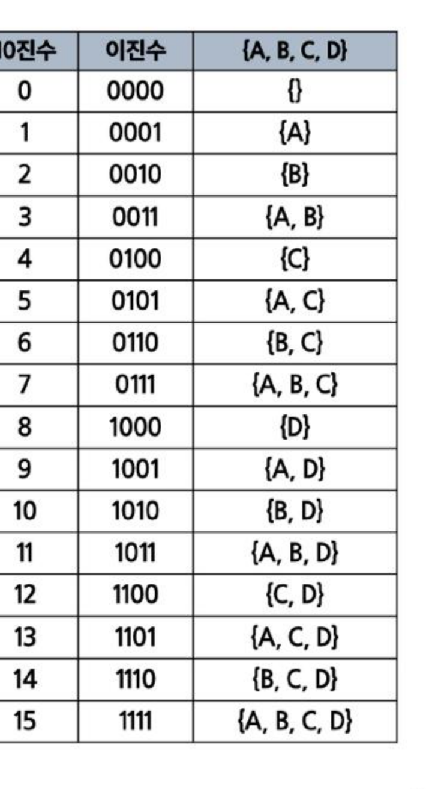

# SW문제해결기본 부분 집합 정리

집합에 포함된 원소들을 선택하는 **부분집합(Power Set)**의 개념과 구현(반복문/재귀/바이너리 카운팅), 그리고 [참고]로 **비트 연산**을 정리한 문서입니다.

---

## 1. 부분집합(Power Set)

* 집합에 포함된 원소들을 선택하는 것이다.
* 많은 중요 알고리즘들이 원소들의 그룹에서 최적의 부분 집합을 찾는 데 사용된다. (예: 배낭 짐싸기(knapsack))

### 부분 집합(Power Set)의 수
* N개의 원소를 포함한 집합에서 공집합을 포함한 부분집합의 개수는 `2^N`개이다.
* 각 원소를 부분집합에 포함하거나 포함하지 않거나 2가지 경우를 모든 원소에 적용한 것과 같다.
* 예) `{1, 2, 3, 4}` → `2 x 2 x 2 x 2 = 16가지`

---

## 2. 부분집합 구현

### 구현 — 반복문
`{1, 2, 3}` 집합의 모든 부분 집합을 반복문으로 생성

```python
selected = [0] * 3
for i in range(2):
    selected[0] = i
    for j in range(2):
        selected[1] = j
        for m in range(2):
            selected[2] = m
            subset = []
            for n in range(3):
                if selected[n] == 1:
                    subset.append(n+1)
            print(subset)
```

### 구현 — 재귀
`{1, 2, 3}` 집합의 모든 부분 집합을 재귀로 생성 — 각 원소를 부분집합에 포함/비포함 형태로 재귀적 구현

```python
def generate_subset(depth, included):
    if depth == len(input_list):
        cnt_subset = [input_list[i] for i in range(len(input_list)) if included[i]]
        subsets.append(cnt_subset)
        return

    included[depth] = False
    generate_subset(depth + 1, included)

    included[depth] = True
    generate_subset(depth + 1, included)

input_list = [1, 2, 3]
subsets = []
init_included = [False] * len(input_list)
generate_subset(0, init_included)
print(subsets)
```

### 구현 — 바이너리 카운팅(Binary Counting)
* 부분집합을 생성하기 가장 자연스러운 방법이다.
* 원소 수에 해당하는 N개의 비트열을 이용한다.
* n번 비트값이 1이면 n번 원소가 포함되었음을 의미한다.



`{1, 2, 3}` 집합의 모든 부분 집합을 바이너리 카운팅으로 생성

```python
arr = [1, 2, 3]
n = len(arr)
subset_cnt = 2 ** n

subsets = []
for i in range(subset_cnt):
    subset = []
    for j in range(n):
        if i & (1 << j):
            subset.append(arr[j])
    subsets.append(subset)

print(subsets)
```
* `i & (1 << j)`: 정수 `i`의 이진수 표현에서 `j`번째 비트가 1인지를 검사하는 식으로, 해당 비트가 1이면 `j`번째 원소가 이번 부분집합에 포함된다는 뜻이다.

### 연습문제: 부분집합의 합
* `{1, 2, 3, 4, 5, 6, 7, 8, 9, 10}`의 부분집합 중 원소의 합이 10인 부분집합을 모두 출력하기 → 바이너리 카운팅(또는 재귀)으로 모든 부분집합을 생성한 뒤, 각 부분집합의 원소 합이 10인 경우만 필터링하여 출력한다.

---

## 3. [참고] 비트 연산

### 비트와 바이트
* 컴퓨터에서 데이터는 0과 1로 이루어진 **비트**로 표현된다.
* `1 bit`: 0과 1을 표현하는 정보의 단위
* `1 Byte`: 8 bit를 묶어 1 Byte라고 한다.
* 예시: `10010110 11011100`은 총 몇 비트이면서, 몇 바이트인가? → 16비트, 2바이트

### 비트 연산
* 컴퓨터의 CPU는 0과 1로 다루어 동작되며, 내부적으로 비트 연산을 사용하여 덧셈, 뺄셈, 곱셈 등을 계산한다.
* CPU가 직접 지원하는 가장 기본적인 연산으로 매우 빠르고 효율적으로 동작한다.
* 비트연산 챕터의 목적: 사람이 사용하는 사칙연산(`+`, `*`, `/`, `-`)이 아닌 컴퓨터가 사용하는 연산인 "비트연산"을 이해해보고, 더 나아가 프로그래밍에서 비트연산을 활용한 코딩 방법을 익혀본다.

### 비트 연산자

| 연산자 | 연산자의 기능 |
|---|---|
| `&` | 비트 단위로 AND 연산을 한다. 예) `num1 & num2` |
| `\|` | 비트 단위로 OR 연산을 한다. 예) `num1 \| num2` |
| `^` | 비트 단위로 XOR 연산을 한다. (같으면 0, 다르면 1) 예) `num1 ^ num2` |
| `~` | 단항 연산자로서 피연산자의 모든 비트를 반전시킨다. 예) `~num` |
| `<<` | 피연산자의 비트 열을 왼쪽으로 이동시킨다. 예) `num << 2` |
| `>>` | 피연산자의 비트 열을 오른쪽으로 이동시킨다. 예) `num >> 2` |

### `<<` 연산자 (왼쪽 시프트)
* `value << n`: value를 n 비트만큼 왼쪽으로 shift. 왼쪽으로 밀어내고 남는 오른쪽 자리는 0으로 채운다.
* 예) `10 << 2` → `1010`을 왼쪽으로 2비트 밀면 `101000` (=40)
* 예) `1 << 1` → `1`을 왼쪽으로 1비트 밀면 `10` (=2)

### `&` 연산자 (AND)
* `value1 & value2`: 각 비트열을 비교하여 두 비트 모두 1이면 1, 아니면 0으로 처리
* 예) `10 & 3` → `1010 & 0011` = `0010` (=2)
* 예) `10 & (1 << 3)` → 10의 3번 비트가 켜져 있는지 검사

### `|` 연산자 (OR)
* `value1 | value2`: 각 비트열을 비교하여 두 비트 모두 0이면 0, 아니면 1로 처리
* 예) `10 | 3` → `1010 | 0011` = `1011` (=11)

---

## 핵심 요약
* **부분집합(Power Set)**은 N개의 원소로 이루어진 집합에서 만들 수 있는 모든 부분집합으로, 공집합을 포함해 `2^N`개가 존재한다(각 원소를 포함/비포함 2가지로 선택하는 결과).
* 부분집합은 **N중 반복문**, **재귀(포함/비포함을 각각 호출)**, 그리고 가장 자연스러운 방법인 **바이너리 카운팅**(0~2^N-1의 각 정수의 비트열을 원소 포함 여부로 해석)으로 구현할 수 있다.
* 바이너리 카운팅 구현의 핵심은 `i & (1 << j)`로 정수 `i`의 `j`번째 비트가 켜져 있는지 검사하는 것이다.
* **비트 연산(`&`, `|`, `^`, `~`, `<<`, `>>`)**은 CPU가 직접 지원하는 가장 빠른 연산으로, 부분집합·조합 문제를 다룰 때 원소의 포함 여부를 비트로 표현하고 다루는 데 핵심적으로 활용된다.
