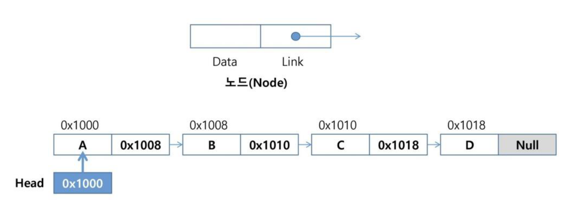
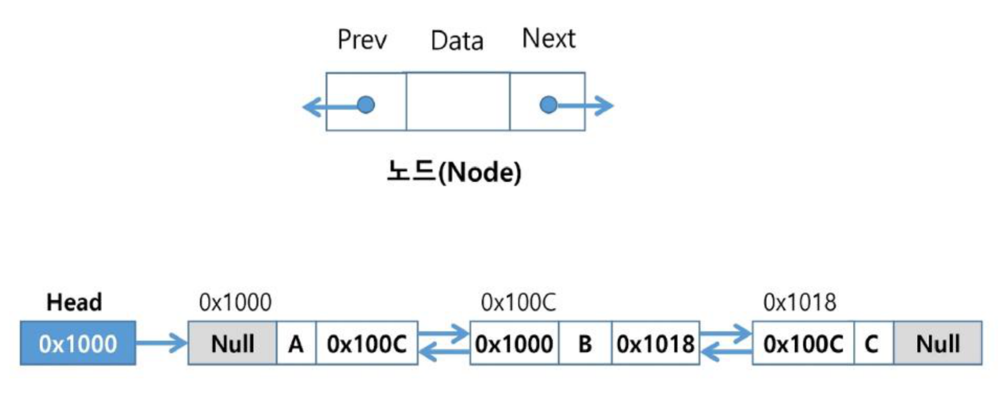

# SW문제해결기본 연결리스트 정리

배열(리스트) 기반 자료구조의 한계를 보완하는 **연결 리스트(Linked List)**의 구조와 원리, **단순 연결 리스트**의 삽입/삭제/구현, **이중 연결 리스트**, 그리고 [참고]로 **deque**를 정리한 문서입니다.

---

## 1. 연결 리스트란

### 리스트의 문제점
* 자료의 삽입/삭제 연산 과정에서 연속적인 메모리 배열을 위해 원소들을 이동시키는 작업이 필요하다.
* 원소의 개수가 많고 삽입/삭제 연산이 빈번하게 일어날수록 작업에 소요되는 시간이 크게 증가한다.

### 연결 리스트(Linked List)
* 자료의 논리적인 순서와 메모리 상의 물리적인 순서가 일치하지 않고, 개별적으로 위치하고 있는 각 원소를 연결하여 하나의 전체적인 자료구조를 이룬다.
* **링크**를 통해 원소에 접근하므로, 리스트에서처럼 물리적인 순서를 맞추기 위한 작업이 필요하지 않다.
* 자료구조의 크기를 동적으로 조정할 수 있어, 메모리의 효율적인 사용이 가능하다.

### 연결 리스트의 기본 구조
* **노드(Node):** 연결 리스트에서 하나의 원소를 표현하는 기본 구성 요소
  * **데이터 필드:** 원소의 값을 저장 (저장할 원소의 종류나 크기에 따라 구조를 정의하여 사용)
  * **링크 필드:** 다음 노드의 참조 값을 저장
* **헤드(Head):** 연결 리스트의 첫 노드에 대한 참조 값을 갖고 있음

---

## 2. 단순 연결 리스트(Singly Linked List)

* 노드가 하나의 링크 필드에 의해 다음 노드와 연결되는 구조를 가진다.
* 헤드가 가장 앞의 노드를 가리키고, 링크 필드가 연속적으로 다음 노드를 가리킨다.
* 링크 필드가 `Null`인 노드가 연결 리스트의 가장 마지막 노드이다.



### 노드 삽입
* **첫 번째 노드로 삽입:** 새로운 노드 `new`를 생성 → 데이터 필드에 값 저장 → Head에 저장된 참조값을 new의 링크 필드에 저장 → Head에 new의 참조값을 저장
* **마지막 노드로 삽입:** 새로운 노드 `new` 생성 → 데이터 필드에 값, 링크 필드에는 Null 저장 → 리스트의 마지막 노드의 링크 필드에 new의 참조값을 저장
* **가운데 노드로 삽입:** 새로운 노드 `new` 생성 → 삽입될 위치의 바로 앞에 위치한 노드의 링크 필드값을 new의 링크 필드에 저장 → new의 참조값을 바로 앞 노드의 링크 필드에 저장

### 노드 삭제
* **가운데 노드를 삭제:** 삭제할 노드의 앞 노드(선행노드)를 찾음 → 삭제할 노드의 링크 필드를 선행노드의 링크 필드에 복사 → 삭제할 노드의 링크 필드에는 Null 저장
* **첫 번째 노드를 삭제:** 삭제할 노드의 앞 노드(선행노드)가 없음 → 삭제할 노드의 링크 필드를 리스트의 Head에 복사 → 삭제할 노드의 링크 필드에 Null 저장

### 구현

```python
class Node:
    def __init__(self, data):
        self.data = data
        self.next = None

class SinglyLinkedList:
    def __init__(self):
        self.head = None

    def insert(self, data, position):
        new_node = Node(data)
        if position == 0:
            new_node.next = self.head
            self.head = new_node
        else:
            current = self.head
            for _ in range(position - 1):
                if current is None:
                    print("범위를 벗어난 삽입입니다.")
                    return
                current = current.next
            new_node.next = current.next
            current.next = new_node

    def append(self, data):
        new_node = Node(data)
        if self.is_empty():
            self.head = new_node
        else:
            current = self.head
            while current.next:
                current = current.next
            current.next = new_node

    def delete(self, position):
        if self.is_empty():
            print("삭제할 원소가 리스트에 비어있습니다.")
            return
        if position == 0:
            deleted_data = self.head.data
            self.head = self.head.next
        else:
            current = self.head
            for _ in range(position - 1):
                if current is None or current.next is None:
                    print("범위를 벗어난 삭제입니다.")
                    return
                current = current.next
            deleted_node = current.next
            deleted_data = deleted_node.data
            current.next = deleted_node.next
        return deleted_data

    def search(self, data):
        current = self.head
        position = 0
        while current:
            if current.data == data:
                return position
            current = current.next
            position += 1
        return -1

    def is_empty(self):
        return self.head is None
```

### 단순 연결 리스트의 장단점
* **장점**
  * 필요한 만큼만 메모리를 사용
  * 연속된 메모리 블록이 필요하지 않아, 메모리 관리가 더 유연
* **단점**
  * 특정 요소에 접근하려면 순차적으로 탐색해야 한다. (시간 복잡도: O(N))
  * 역방향 탐색 불가
  * 마지막 요소로 접근하거나 추가하려면 전체 리스트를 순회해야 함

---

## 3. 이중 연결 리스트(Doubly Linked List)

* 양쪽 방향으로 순회할 수 있도록 노드를 연결한 리스트
* 두 개의 링크 필드(`Prev`, `Next`)와 한 개의 데이터 필드로 구성



### 삽입 (cur 다음에 새 노드 D 삽입)
1. 새로운 노드 `new`를 생성하고 데이터 필드에 값을 저장한다.
2. `cur`노드의 `next`를 `new`노드의 `next`에 저장하여 `cur`의 다음 노드를 `new`노드의 다음 노드로 연결한다.
3. `cur`의 참조값을 `new`노드의 `prev`에 저장하여 `cur`를 `new`노드의 이전 노드로 연결한다.
4. `new`의 참조값을 `new`노드의 다음 노드의 `prev`에 저장하여 `new`노드의 다음 노드의 이전 노드로 `new`노드를 연결한다.
5. `new`의 참조값을 `cur`의 `next`에 저장하여 `cur`의 다음 노드를 `new`노드로 연결한다.

### 삭제 (cur이 가리키는 노드를 삭제)
1. 삭제할 노드 `cur`의 `next`를 `cur`의 이전 노드의 `next`에 저장하여 `cur`의 이전 노드의 다음 노드로 연결한다.
2. 삭제할 노드 `cur`의 `prev`를 `cur`의 다음 노드의 `prev`에 저장하여 `cur`의 다음 노드의 이전 노드로 연결한다.
3. 삭제할 노드 `cur`의 `prev`, `next`에 `Null`을 저장한다.

* 단순 연결 리스트와 달리 이전 노드로도 접근할 수 있어 양방향 탐색이 가능하지만, 각 노드마다 링크 필드가 하나 더 필요해 메모리를 더 사용한다.

---

## 4. [참고] deque

* 컨테이너 자료형 중 하나
* 리스트의 맨 앞 데이터를 꺼낼 경우, 모든 데이터가 재배치되는 문제(`pop(0)`의 O(N) 비용)를 해결
* **deque 객체:** 양쪽 끝에서 빠르게 추가와 삭제를 할 수 있는 리스트류 컨테이너
* 연산: `append(x)`(오른쪽에 x 추가), `popleft()`(왼쪽에서 요소를 제거하고 반환. 요소가 없으면 IndexError)

```python
from collections import deque

queue = deque()
queue.append(1)      # enqueue()
pop_data = queue.popleft()  # dequeue()
```

---

## 핵심 요약
* **연결 리스트**는 배열처럼 원소를 물리적으로 이동시키지 않고, 각 노드가 다음(혹은 이전) 노드의 참조(링크)를 갖도록 하여 삽입/삭제 비용을 줄인 자료구조다.
* **단순 연결 리스트**는 `next` 링크 하나로 다음 노드를 가리키며, 첫 노드·마지막 노드·가운데 노드 삽입/삭제 시 앞뒤 노드의 링크만 갱신하면 된다. 다만 특정 위치 접근은 Head부터 순차 탐색해야 해 O(N)이다.
* **이중 연결 리스트**는 `prev`/`next` 두 링크로 양방향 순회가 가능해 단순 연결 리스트의 역방향 탐색 불가 문제를 해결하지만, 노드마다 메모리를 더 사용한다.
* Python에서는 리스트의 `pop(0)`이 매번 전체 재배치를 유발하는 문제를 `collections.deque`의 `append`/`popleft`로 해결할 수 있다.
