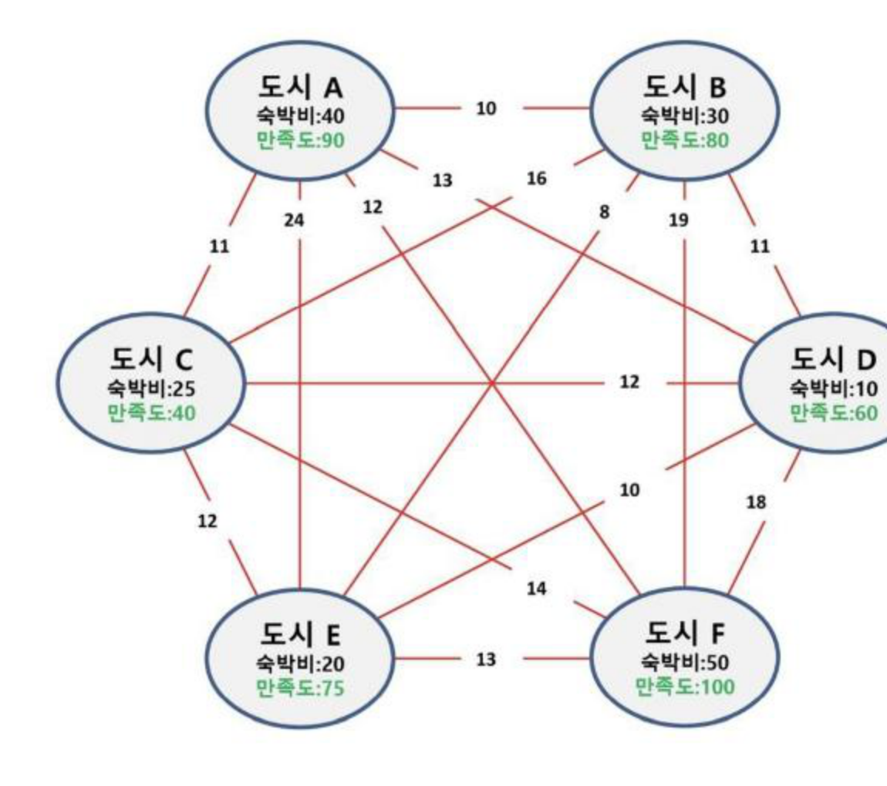

# SW문제해결기본 완전 탐색과 순열 정리

문제 해결의 가장 기본적인 접근법인 **완전 탐색(Brute-force)**의 개념과, 완전 탐색·조합적 문제와 깊이 연관된 **순열(Permutation)**의 정의·공식·구현(반복문/재귀)을 정리한 문서입니다.

---

## 1. 완전 탐색(Brute-force)

### Baby-gin Game 예제로 보는 완전 탐색
* 0~9 사이의 숫자 카드에서 임의의 카드 6장을 뽑았을 때, 3장의 카드가 연속적인 번호를 갖는 경우 `run`이라 하고, 3장의 카드가 동일한 번호를 갖는 경우를 `triplet`이라 한다.
* 6장의 숫자 카드가 모두 `run` 혹은 `triplet`으로만 구성된 경우를 baby-gin으로 부른다.
* 예) `667767` → 두 개의 triplet이므로 baby-gin이다. (`666, 777`)
* 예) `054060` → 한 개의 run과 한 개의 triplet이므로 역시 baby-gin이다. (`456, 000`)
* 예) `100123` → 한 개의 triplet이 존재하나, 023이 run이므로 아니다 (`123`을 run으로 사용해도 011이 run이나 triplet이 아님)
* **6자리 숫자를 입력 받아 baby-gin 여부를 찾는 방법:** 입력 받은 숫자를 정렬한 후, 앞에서부터 순서대로 3자리씩 끊어서 `run` 및 `triplet`을 확인한다.
  * 위와 같은 방법으로 고려할 수 있는 모든 경우의 수를 생성한 뒤(6개의 숫자로 만들 수 있는 모든 숫자 나열(중복 포함)), 정렬하면 판단이 가능한 경우가 있는 반면, 이 접근으로는 해답을 찾아내지 못하는 경우도 있으니 유의해야 한다.

### 완전 탐색이란?
* 문제의 해법으로 생각할 수 있는 **모든 경우의 수**를 나열해보고 확인하는 기법
* **Brute-force** 혹은 **generate-and-test** 기법이라고도 불리며, `"Just do it"`으로 요약된다.
* 탐욕 알고리즘(Greedy), 분할 정복(Divide and Conquer), 다이나믹 프로그래밍(DP) 등과 함께 대표적인 문제 해결 기법 중 하나이다.
  * **탐욕 알고리즘:** 각 순간에 최적이라고 생각되는 것을 선택해나가는 방식
  * **분할 정복:** 복잡한 문제를 더 작은 문제들로 나누어 해결하는 알고리즘
  * **다이나믹 프로그래밍(DP):** 현재까지 가장 좋아 보이는 것을 선택하는 것이 아니라, 과거의 이전 데이터를 이용하여 현재 데이터를 만들어가는 방식
* 대부분의 문제에 적용이 가능하지만, 상대적으로 빠른 시간에 문제를 해결(알고리즘 설계)할 수도 있다. 일반적으로 경우의 수가 작다면 유용하다.
* 전형적으로 순열(permutation), 조합(combination), 부분집합(subset)과 같은 조합적 문제와 연관된다.
* 검정 등에서 주어진 문제를 풀 때, **우선 완전 검색으로 접근하여 해답을 도출한 후, 성능 개선을 위해 다른 알고리즘을 사용하여 해답을 확인**하는 것이 바람직하다.

### 완전 검색과 조합적 문제
* 많은 종류의 문제들이 특정 조건을 만족하는 경우나 요소를 찾는 것이다.
* 이들은 전형적으로 순열(permutation), 조합(combination) 그리고 부분집합(subset)과 같은 조합적 문제들과 연관된다.

### 예제 — 여행 계획(조합적 문제)
* 출발, 도착 도시를 선택하면 모든 도시를 여행하는 코스를 알려준다. 모든 도시를 여행하는 코스를 정할 때 어떤 코스가 경비가 가장 적게 들까?
* 3개의 도시를 선택하면 숙박비를 지원해 준다. 여행자는 어느 도시를 선택했을 때 가장 이득일까?
* 여행 경비를 넘지 않으면서 최대 만족도를 갖도록 선택하려면 어떤 코스가 좋을까?



* 이러한 문제들은 방문할 도시의 순서(순열), 선택할 도시의 조합(조합), 선택할 도시의 부분집합(부분집합)을 모두 나열해보고 조건을 검사하는 완전 탐색으로 접근할 수 있다.

---

## 2. 순열(Permutation)

### 정의
* 서로 다른 것 중 몇 개를 뽑아서 순서대로 나열하는 것
* 서로 다른 n개 중 r개를 택하는 순열은 `nPr`로 표현한다.

```
nPr = n * (n-1) * (n-2) * ... * (n-r+1)
nPn = n!  (Factorial)
n! = n * (n-1) * (n-2) * ... * 2 * 1
```

* 예) 여행지 A, B, C를 방문할 때 가능한 경로는? → **6가지** (`3P3 = 3! = 6`)
* 다수의 알고리즘 문제들은 순서화된 요소들의 집합에서 최선의 방법을 찾는 것과 관련이 있다. N개의 요소에 대해서 `N!`개의 순열이 존재하며, N이 큰 경우 시간 복잡도는 매우 커지므로 폭발적으로 증가한다(예: N=20일 때 20! ≈ 2.4 × 10^18).

### 구현 — 반복문
`{1, 2, 3}`을 포함하는 모든 순열을 중첩 반복문으로 생성

```python
for i in range(1, 4):
    for j in range(1, 4):
        if j != i:
            for k in range(1, 4):
                if k != i and k != j:
                    print(i, j, k)
```
* 반복문으로 구현하는 방법은 N이 커질수록 중첩해야 하는 반복문의 개수도 늘어나므로 비효율적이다.

### 구현 — 재귀
`{1, 2, 3}`을 포함하는 모든 순열을 재귀 함수로 생성

```python
# selected: 선택된 값 목록
# remain: 선택되지 않은 값의 목록
def perm(selected, remain):
    if not remain:
        print(selected)
    else:
        for i in range(len(remain)):
            select_i = remain[i]
            remain_list = remain[:i] + remain[i+1:]
            perm(selected + [select_i], remain_list)

perm([], [1, 2, 3])
```

### [참고] 순열 활용

**중복 순열:** 순서를 고려하여 여러번 선택할 수 있게 나열하는 모든 가능한 방법. 예) 비밀번호를 생성할 때, 각 자리의 문자는 중복될 수 있으므로 순서를 고려해야 한다.
* 원소를 1개 선택하는 경우 (3개): `1, 2, 3`
* 원소를 2개 선택하는 경우 (9개): `1,1 1,2 1,3 2,1 2,2 2,3 3,1 3,2 3,3`
* 원소를 3개 선택하는 경우 (27개): `1,1,1 1,1,2 1,1,3 1,2,1 …`

**itertools:** 반복(iteration)과 관련된 다양한 함수를 제공하는 파이썬 표준 라이브러리로, 순열과 조합을 손쉽게 구할 수 있다.

```python
import itertools
arr = [1, 2, 3]

print(list(itertools.permutations(arr)))
# [(1, 2, 3), (1, 3, 2), (2, 1, 3), (2, 3, 1), (3, 1, 2), (3, 2, 1)]

print(list(itertools.product(arr, repeat=2)))  # 중복 순열
# [(1, 1), (1, 2), (1, 3), (2, 1), (2, 2), (2, 3), (3, 1), (3, 2), (3, 3)]
```

---

## 핵심 요약
* **완전 탐색(Brute-force)**은 가능한 모든 경우의 수를 나열해서 확인하는 가장 기본적인 문제 해결 기법으로, 대부분의 문제에 적용 가능하지만 경우의 수가 커지면 비효율적이라 우선 완전 탐색으로 정답을 확인한 후 더 나은 알고리즘으로 성능을 개선하는 흐름이 바람직하다.
* 완전 탐색 문제들은 전형적으로 **순열·조합·부분집합**과 같은 조합적 문제와 연결된다(예: 여행 계획 문제).
* **순열(nPr)**은 서로 다른 n개 중 r개를 뽑아 순서대로 나열하는 것으로 `n * (n-1) * ... * (n-r+1)`이며, `nPn = n!`이다.
* 순열은 **중첩 반복문**(N이 커지면 비효율적) 또는 **재귀 함수**(선택된 값과 남은 값을 나누어 처리)로 구현할 수 있으며, 파이썬에서는 `itertools.permutations`/`itertools.product`로 순열·중복순열을 간단히 구할 수 있다.
