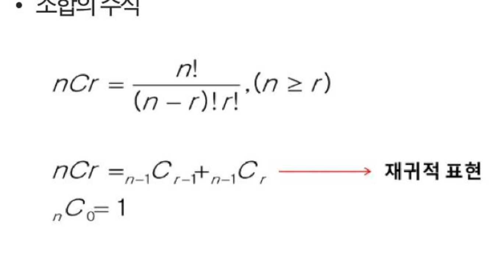

# SW문제해결기본 조합 정리

순서를 고려하지 않고 원소를 선택하는 **조합(Combination)**의 정의·공식·구현(반복문/재귀)과, 중복 순열·중복 조합, 그리고 연습문제 **4012. 요리사**를 정리한 문서입니다.

---

## 1. 조합(Combination)

* 순서를 고려하지 않고 아이템을 선택하는 방법
* 예) 1부터 45까지의 숫자 중 6개를 선택해서 당첨 ⇒ 약 815만분의 1 (로또)
* 서로 다른 n개의 원소 중 r개를 **순서 없이** 골라낸 것!

### 조합의 수식


* `nCr = n! / ((n-r)! * r!)`, `(n ≥ r)`
* **재귀적 표현:** `nCr = (n-1)C(r-1) + (n-1)Cr`, `nC0 = 1`
  * n개의 원소 중 특정 원소 하나를 포함하는 경우의 수(`(n-1)C(r-1)`)와 포함하지 않는 경우의 수(`(n-1)Cr`)로 나누어 재귀적으로 계산할 수 있다.

---

## 2. 조합 구현

### 구현 — 반복문
`{1, 2, 3, 4}` 중 원소 3개를 포함하는 모든 조합을 반복문으로 생성

```python
for i in range(1, 5):
    for j in range(i+1, 5):
        for k in range(j+1, 5):
            print(i, j, k)
```
* 순열과 달리 이미 선택한 인덱스보다 큰 인덱스만 다음 반복에서 고려하여, 같은 조합이 중복해서 나오지 않도록 한다.

### 구현 — 재귀
`{1, 2, 3, 4}` 중 원소 3개를 포함하는 모든 조합을 재귀 함수로 생성

```python
def comb(arr, n):
    result = []
    if n == 1:
        return [[i] for i in arr]

    for i in range(len(arr)):
        elem = arr[i]
        for rest in comb(arr[i + 1:], n - 1):
            result.append([elem] + rest)
    return result

print(comb([1, 2, 3, 4], 3))
```
* 재귀를 활용한 구현을 조금만 응용하면 다양한 순열과 조합을 구현할 수 있다.

```python
def comb(arr, n):
    result = []  # 조합을 저장할 리스트
    if n == 1:
        return [[i] for i in arr]

    for i in range(len(arr)):
        elem = arr[i]
        for rest in comb(arr[i + 1:], n - 1):        # 조합
        # for rest in comb(arr[:i] + arr[i+1:], n - 1):  # 순열
        # for rest in comb(arr, n - 1):                   # 중복조합
        # for rest in comb(arr[i:], n - 1):               # 중복조합
            result.append([elem] + rest)
    return result
```

---

## 3. [참고] 조합 활용

### 중복 순열
* 순서를 고려하여 여러 번 선택할 수 있게 나열하는 모든 가능한 방법
* 예) 비밀번호를 생성할 때, 각 자리의 문자는 중복될 수 있으며 순서를 고려해야 한다.
* `{1, 2, 3}`에서 원소 2개를 선택하는 경우 (9개): `1,1  1,2  1,3  2,1  2,2  2,3  3,1  3,2  3,3`

### 중복 조합
* 순서를 고려하지 않고 여러 번 선택할 수 있게 나열하는 모든 가능한 방법
* 예) 아이스크림 가게에서 여러 가지 맛 중에서 원하는 맛을 선택하는 경우
* `{1, 2, 3}`에서 원소 2개를 선택하는 경우 (6개): `1,1  1,2  1,3  2,2  2,3  3,3`

### itertools로 구하기

```python
import itertools
arr = [1, 2, 3]

print(list(itertools.permutations(arr)))              # 순열
print(list(itertools.combinations(arr, 2)))            # 조합
# [(1, 2), (1, 3), (2, 3)]

print(list(itertools.product(arr, repeat=2)))          # 중복 순열
print(list(itertools.combinations_with_replacement(arr, 2)))  # 중복 조합
# [(1, 1), (1, 2), (1, 3), (2, 2), (2, 3), (3, 3)]
```

---

## 4. 문제풀이 — 4012. 요리사

* 두 명의 요리사(예서, 성진)가 음식을 재료로 요리를 한다.
* 두 명의 요리사는 모두 같은 재료를 사용하며, 재료의 순서(사용 여부)에 따라 음식의 맛이 달라진다.
* N개 재료를 두 그룹(A조/B조)으로 나눠 각 조합마다 스코빌 지수 차이의 절댓값을 구하고, 그 최솟값을 구하는 문제이다.
* N개의 재료를 절반씩(N/2개, N/2개) 두 그룹으로 나누는 **조합**의 경우의 수를 모두 탐색(완전 탐색)하면서, 각 조합에서 두 그룹 간 스코빌 지수 합의 차이의 최솟값을 찾는 방식으로 풀 수 있다.

---

## 핵심 요약
* **조합(nCr)**은 서로 다른 n개 중 r개를 **순서 없이** 뽑는 방법의 수로, `n! / ((n-r)!r!)`이며 `nCr = (n-1)C(r-1) + (n-1)Cr`의 재귀적 관계를 갖는다.
* 조합은 반복문에서 **이미 선택한 인덱스보다 큰 인덱스만 다음 탐색 대상으로 삼아** 중복 없이 구현하며, 재귀 함수에서도 `arr[i+1:]`처럼 현재 원소 이후의 배열만 다음 호출에 넘겨 구현한다.
* 재귀 조합 함수의 슬라이싱 범위를 바꾸면(`arr[i+1:]` → `arr[:i]+arr[i+1:]`/`arr`/`arr[i:]`) 순열·중복조합 등 다양한 조합적 나열을 같은 구조로 구현할 수 있다.
* **중복 순열**은 순서를 고려하며 중복 선택이 가능한 나열, **중복 조합**은 순서를 고려하지 않으며 중복 선택이 가능한 나열이며, 파이썬 `itertools`의 `permutations`/`combinations`/`product`/`combinations_with_replacement`로 각각 구할 수 있다.
* **4012. 요리사**는 N개 재료를 절반씩 두 그룹으로 나누는 조합을 완전 탐색하며 스코빌 지수 차이의 최솟값을 찾는, 조합과 완전 탐색이 결합된 대표적인 문제다.
