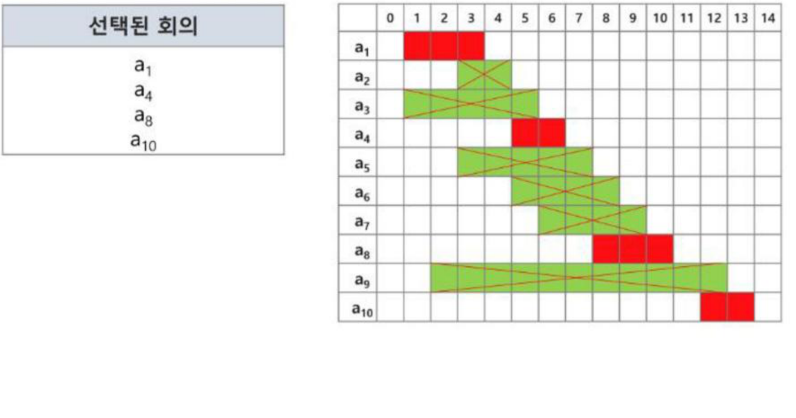

# SW문제해결기본 탐욕 알고리즘 정리

각 순간에 최적이라고 생각되는 선택을 계속 취하는 **탐욕 알고리즘(Greedy Algorithm)**의 개념과, 대표적인 활용 사례인 **동전 교환**, **배낭 짐싸기(Knapsack)**, **활동 선택 문제**, 그리고 탐욕 알고리즘이 성립하기 위한 필수 요소를 정리한 문서입니다.

---

## 1. 탐욕 알고리즘(Greedy)이란?

* 최적화 문제를 구하는 데 사용되는 근시안적인 방법
* 최적화 문제(optimization)란 가능한 해들 중에서 가장 좋은(최대 혹은 최소) 해를 찾는 문제이다.
* 일반적으로 여러 옵션 중 하나를 반복적으로 선택해가면서 답을 구하는 방식으로 진행하며, 매 순간에 지역적으로 최적이라고 생각되는 것을 선택해 나가는 방식으로 진행한다.
* 각 선택 시점에서 이루어지는 결정은 지역적으로는 최적이지만, 선택들을 계속 수집하여 최종적인 문제의 답이 되었을 때 그것이 최적이라는 보장은 없다.
* 일단, 한번 선택된 것은 번복하지 않는다. 이런 특성 때문에 대부분의 탐욕 알고리즘은 단순하며, 또한 매력적인 접근법이 적용된다.
* **최적해를 반드시 구한다는 보장이 없다.**

---

## 2. 활용 1 — 동전 교환

거스름돈을 최소한의 동전 수로 지불하는 문제

* 잔액 값: 1,200원 / 반환 돈: 2,000원 / 거스름돈: 800원
* 동전 종류: 500원, 100원, 50원, 10원
* **"큰 동전부터 최대한 거슬러 주면 된다."**
  1. 거스름돈 800원 - 500원 1개 = 잔액 300원
  2. 잔액 300원 - 100원 3개 = 0원
  3. 총 3개의 동전 사용

이처럼, 좋아 보이는 값을 먼저 선택하는 것을 **탐욕(Greedy) 알고리즘**이라고 한다.

```python
def get_minimum_coins(coins, amount):
    result = []
    coins.sort(reverse=True)
    for coin in coins:
        if amount // coin:
            coin_cnt = amount // coin
            amount -= coin * coin_cnt
            result[coin] = coin_cnt
    return result

coins = [10, 50, 100, 500]  # 동전 종류
amount = 800  # 거스름돈
result = get_minimum_coins(coins, amount)
for coin, count in result.items():
    print(f"{coin}원: {count}개")
```

* **동전 종류가 달라진 조건**에서는 최소한의 동전 수로 지불하는 문제가 성립하지 않을 수도 있다. 예) 동전 종류: 500원, 400원, 100원, 10원인 경우 큰 동전부터 최대한 거슬러 주면 최적의 개수가 나오지 않을 수 있다. → 결국 각 동전의 가치가 그보다 작은 모든 동전의 배수여야 탐욕 알고리즘이 성립한다.
  * 그러니 탐욕 알고리즘은 복잡한 문제를 간단하게 풀 수도 있지만, 그것을 지 증명하기는 어렵다.

---

## 3. 활용 2 — 배낭 짐싸기(Knapsack)

### 배낭 짐싸기(Knapsack) 문제의 정형적 정의
* `S = {item1, item2, ..., itemN}`: 물건들의 집합
* `Wi`: item `i`의 무게, `Pi`: item `i`의 값
* `W`: 배낭이 수용 가능한 총 무게
* 무게의 합이 `W`를 만족하면서, 값의 합이 최대가 되도록 하는 `item`들의 부분집합(`S`의 부분집합)을 결정하는 문제

### Knapsack의 대표적인 문제 유형
* **0-1 Knapsack:** 배낭에 물건을 통째로 담아야 하는 문제. 물건을 쪼갤 수 없는 경우
* **Fractional Knapsack:** 물건을 부분적으로 담을 수 있는 문제. 물건을 쪼갤 수 있는 경우

### 0-1 Knapsack에 대한 탐욕적 방법의 한계
* `W = 30kg`, 물건1(25kg, 10만원), 물건2(10kg, 9만원), 물건3(10kg, 5만원)
* **가치가 비싼 물건부터 채운다**면 → 물건1 ⇒ 25kg, 10만원이 최적(다른 물건은 넣을 수 없음)이지만, 실제로는 물건2+물건3(20kg, 14만원)이 더 좋은 답이다. → **탐욕적 방법으로는 최적해를 구할 수 없다.**
* **무게당(kg당) 값이 높은 순서로 물건을 채운다**면 → 물건2, 물건3(20kg, 14만원)이 최적처럼 보이지만, 역시 최적해를 구하기 어렵다.
* ⇒ **0-1 Knapsack**은 물건을 쪼갤 수 없어 탐욕적 선택이 전체 최적해를 보장하지 못하며, 완전 검색(부분집합을 모두 구하는 방법, 물건이 N개면 시간복잡도 `O(2^N)`)이나 다이나믹 프로그래밍으로 해결해야 한다.

### Fractional Knapsack 문제
* 물건의 일부를 잘라서 담을 수 있다.
* **탐욕적 방법:** 무게당(kg당) 값이 높은 물건부터, 배낭이 채워질 때까지 최대한 담는다(마지막 물건은 남는 무게만큼만 쪼개어 담음).
* `W = 30kg`, 물건1(5kg, 50만원 → 10만원/kg), 물건2(10kg, 60만원 → 6만원/kg), 물건3(20kg, 14만원 → 7천원/kg)인 경우
  * 물건1(5kg) + 물건2(20kg 중 20kg 담고) + 물건3(5kg) ⇒ 30kg, 220만원
  * Fractional Knapsack은 무게당 값이 높은 순으로 채우는 탐욕적 방법으로 **항상 최적해**를 구할 수 있다.

---

## 4. 활용 3 — 활동 선택 문제

* 강의실에서 개설되는 강의들의 희망 신청을 처리하는 업무를 한다. 이번 주 금요일에 사용 가능한 강의실은 하나만 존재하고 다수의 희망자가 신청했다.
* 희망하는 시작 시간과 종료 시간이 있으며, 희망 시간이 겹치는 희망자는 동시에 앨할 수 없다.
* 가능한 많은 희망이 열리기 위해서는 희망일을 어떻게 배정해야 할까?
* **시작시간과 종료시간(t_i, f_i)이 있는 n개의 활동 집합 `A = {A_1, A_2, ..., A_n}, 1 ≤ i ≤ n`에서 서로 겹치지 않는(non-overlapping) 최대개수의 활동들의 집합 S를 구하는 문제**
* 양립 가능한 활동의 크기가 최대가 되는 `S_max`의 부분집합을 선택하는 문제

### 탐욕 기법을 적용한 반복 알고리즘
* **종료 시간이 빠른 순서대로 활동들을 정렬한다.**
* 첫번째 활동(a1)을 선택한다.
* 선택한 활동(a_i)의 종료시간(f_i)보다 빠른 시작 시간을 가지는 후보는 무시하고, 그다음 시작 시간이 종료시간(f_i)보다 늦은 후보중 종료시간이 가장 빠른 활동을 선택한다.
* 선택한 활동의 종료시간을 기준으로 다시 남은 활동들에 대해 같은 과정을 반복한다.

### 예제 — 종료시간으로 정렬된 10개의 회의들
```
(1,4), (3,5), (1,6), (5,7), (3,8), (5,9), (6,10), (8,11), (2,13), (12,14)
```
종료 시간이 빠른 순으로 `a1(1,4)`를 선택 → `a1`의 종료시간(4) 이후 시작하면서 종료시간이 가장 빠른 `a4(5,7)`를 선택 → 이어서 `a8(8,11)` → `a10(12,14)` 선택



* **최종 선택된 회의:** `a1, a4, a8, a10` (총 4개, 겹치지 않는 최대 개수)

---

## 5. 탐욕 알고리즘의 필수 요소

* **탐욕적 선택 속성(greedy choice property):** 탐욕적 선택은 최적해로 갈 수 있음을 보여야 한다. ⇒ 즉, 앞의 선택이 항상 안전하다.
* **최적 부분 구조(optimal substructure property):** 최적의 문제 해결 방안이 항상 하위 문제의 최적 문제 해결 방안으로 구성된다.
  ⇒ 하위 문제의 최적해를 활용해 원래 문제의 최적해를 구할 수 있어야 한다.
* **[원문제의 최적해 = 탐욕적 선택 + 하위 문제의 최적해]**임을 증명하라.

### 대표적인 탐욕 기법의 알고리즘들

| 알고리즘 | 목적 | 설명 | 유형 |
|---|---|---|---|
| Prim | N개의 노드에 대한 최소 신장 트리(MST)를 찾는다. | 서브트리를 확장하면서 MST를 찾는다. | 그래프 |
| Kruskal | N개의 노드에 대한 최소 신장 트리(MST)를 찾는다. | 싸이클이 없는 서브 그래프를 확장하면서 MST를 찾는다. | 그래프 |
| Dijkstra | 주어진 정점에서 다른 정점들에 대한 최단 경로를 찾는다. | 주어진 정점에서 가장 가까운 정점을 찾고, 그 다음 정점을 반복해서 찾는다. | 그래프 |

---

## 6. 문제풀이 — 22375. 스위치 조작

* N개의 전등이 설치되어 있다. 각 전등은 번호(1번~N번)가 붙어있고, 반드시 스위치를 조작하면 번호까지의 전등이 켜지거나 꺼지도록 반전된다.
* 모든 전등의 현재 상태와 스위치 조작 후 상태가 주어지면 최소 몇 번의 스위치를 조작해야 하는지 구한다.
* 전등이 켜진 상태는 스위치 조작 후 상태에서 현재 상태로, 앞에서부터 순서대로(그리디하게) 필요한 지점마다 스위치를 켜고 끄면서 최소 조작 횟수를 구한다.
* 예) 현재 상태 A = `0000`(모두 꺼짐), 조작 후 상태 B = `1000`인 경우, 첫 스위치를 조작해 `1000`인 상태로 만들 수 있으므로, 최소 2번의 조작이 필요하다.

---

## 핵심 요약
* **탐욕 알고리즘**은 매 순간 지역적으로 최적이라고 생각되는 선택을 계속 취해나가는 근시안적 문제 해결 기법으로, 빠르고 단순하지만 **최적해를 반드시 구한다는 보장이 없다.**
* **동전 교환**은 큰 동전부터 채우는 탐욕이 최적해를 주지만, 이는 동전 단위가 서로의 배수 관계일 때만 성립하며 일반적으로는 성립하지 않을 수 있다.
* **0-1 Knapsack**은 물건을 쪼갤 수 없어 탐욕적 선택(비싼 것부터, 무게당 비싼 것부터)이 최적해를 보장하지 못하지만, **Fractional Knapsack**은 물건을 쪼갤 수 있어 무게당 가치가 높은 순으로 채우는 탐욕이 항상 최적해를 준다.
* **활동 선택 문제**는 종료 시간이 빠른 순으로 정렬한 뒤, 마지막으로 선택한 활동의 종료 시간 이후에 시작하면서 가장 빨리 끝나는 활동을 반복적으로 선택하는 탐욕 알고리즘으로 겹치지 않는 최대 개수의 활동을 구한다.
* 탐욕 알고리즘이 최적해를 보장하려면 **탐욕적 선택 속성**(현재의 탐욕적 선택이 안전함)과 **최적 부분 구조**(원문제의 최적해 = 탐욕적 선택 + 하위 문제의 최적해)를 모두 만족해야 하며, Prim·Kruskal·Dijkstra가 이를 만족하는 대표적인 그래프 알고리즘이다.
