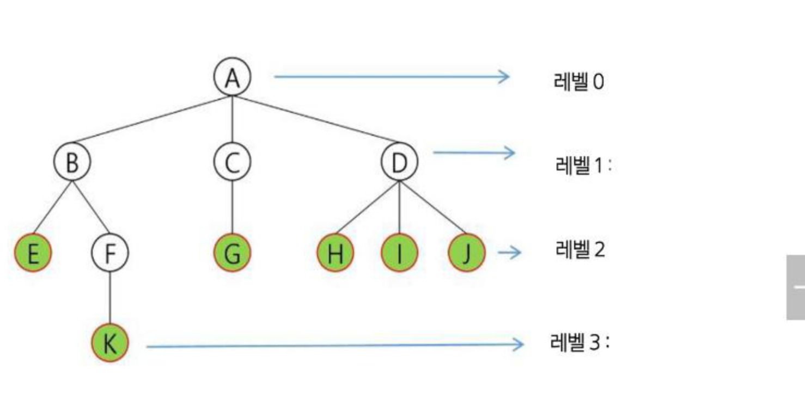
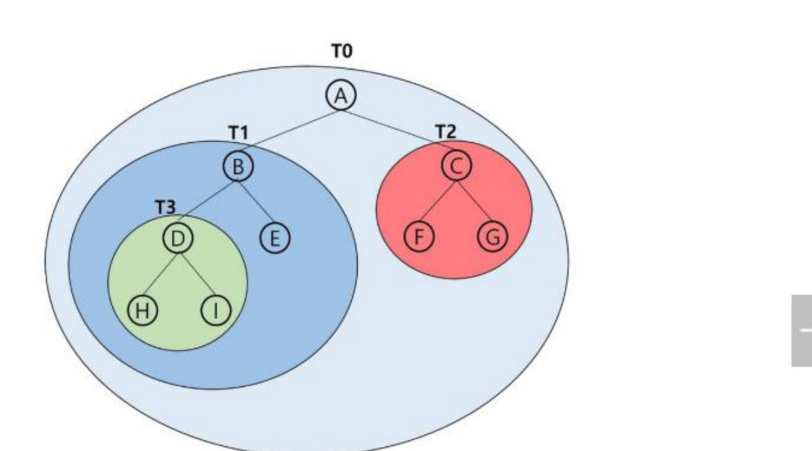

# SW문제해결기본 트리 정리

계층적 자료구조인 **트리(Tree)**의 용어와 **이진 트리(Binary Tree)**의 특성·표현·순회, **수식 트리**, 그리고 트리 탐색 기법인 **DFS**를 정리한 문서입니다.

---

## 1. 트리의 개념과 용어

### 트리의 개념
* **비선형 구조:** 원소들 간에 1:n 관계를 가지는 자료구조
* **계층형 구조:** 원소들 간에 계층관계를 가지는 계층형 자료구조
* 상위 원소에서 하위 원소로 내려가면서 확장되는 트리(나무) 모양의 구조
* 한 개 이상의 노드로 이루어진 유한 집합이며 다음 조건을 만족한다.
  * 노드 중 최상위 노드를 **루트(root)**라 한다.
  * 나머지 노드들은 n(≥0)개의 분리 집합 `T1, …, TN`으로 분리될 수 있다.
  * 이들 `T1, …, TN`은 각각 하나의 트리가 되며(재귀적 정의), 루트의 **부트리(subtree)**라 한다.

### 트리 용어
* **노드(node):** 트리의 원소
* **간선(edge):** 노드와 노드를 연결하는 선. 부모 노드와 자식 노드를 연결
* **루트 노드(root node):** 트리의 시작 노드인 최상위 노드
* **형제 노드(sibling node):** 같은 부모 노드의 자식 노드들
* **조상 노드(ancestor node):** 간선을 따라 루트 노드까지 이르는 경로에 있는 모든 노드
* **서브 트리(subtree):** 부모 노드와의 연결된 간선을 끊었을 때 생성되는 트리
* **자손 노드(descendant node):** 서브 트리에 있는 하위 레벨의 노드들
* **차수(degree):** 노드의 차수는 노드의 연결된 자식 노드 수. 트리의 차수는 트리에 있는 노드의 차수 중에서 가장 큰 값
* **단말 노드(leaf node):** 차수가 0인 노드, 즉 자식 노드가 없는 노드
* **레벨(level):** 루트에서 노드까지의 거리. 루트 노드의 레벨은 0, 자식 노드의 레벨은 부모 레벨+1
* **높이(height):** 루트 노드에서 가장 먼 리프 노드까지의 간선 수. 트리의 높이는 최대 레벨(트리의 높이)



---

## 2. 이진 트리(Binary Tree)

### 이진 트리 특성
* 모든 노드들이 최대 2개의 서브 트리를 갖는 특별한 형태의 트리 (차수가 2인 트리)
* 각 노드가 자식 노드를 최대 2개까지만 가질 수 있는 트리: **왼쪽 자식 노드(left child node)**, **오른쪽 자식 노드(right child node)**
* 레벨 `i`에서의 노드의 최대 개수는 `2^i`개
* 높이가 `h`인 이진 트리가 가질 수 있는 노드의 최소 개수는 `(h+1)`개가 되며, 최대 개수는 `(2^(h+1) - 1)`개가 된다.

### 이진 트리의 종류
* **포화 이진 트리(Perfect Binary Tree):** 모든 레벨에 노드가 포화 상태로 차 있는 이진 트리. 높이가 `h`일 때 최대 노드 개수인 `(2^(h+1)-1)`개의 노드를 가진 이진 트리
* **완전 이진 트리(Complete Binary Tree):** 높이가 h이고 노드 수가 n일 때(단 `h+1 <= n < 2^(h+1)-1`), 포화 이진 트리의 노드 번호 1번부터 n번까지 빈자리가 없는 이진 트리
* **편향 이진 트리(Skewed Binary Tree):** 높이에 대한 최소 개수의 노드를 가지면서 한쪽 방향의 자식 노드만을 가진 이진 트리 (왼쪽 편향/오른쪽 편향)

---

## 3. 이진 트리의 표현

### 리스트를 이용한 표현
* 이진 트리에 각 노드 번호를 다음과 같이 부여: 루트의 번호를 1로 하며, 레벨 n에 있는 노드에 대하여 왼쪽부터 오른쪽으로 `2^n`부터 `2^(n+1)-1`까지 번호를 차례로 부여
* 노드 번호가 `i`일 때: 부모 노드의 인덱스는 `i/2`, 왼쪽 자식 노드 번호는 `2*i`, 오른쪽 자식 노드 번호는 `2*i+1`
* 높이가 `h`인 이진 트리를 위한 배열의 크기: 레벨의 최대 노드 수가 `1+2+4+ … +2^h = 2^(h+1)-1`이므로, 리스트의 크기는 `2^(h+1)`

```python
class BinaryTree:
    def __init__(self):
        self.tree = [None, 'A', 'B', 'C', 'D', 'E', 'F', 'G', 'H', 'I', 'J', 'K']

    def insert(self, value):
        self.tree.append(value)

    def get_node(self, index):
        if index < len(self.tree):
            return self.tree[index]
        return None

    def set_node(self, index, value):
        while len(self.tree) <= index:
            self.tree.append(None)
        self.tree[index] = value

    def get_left_child(self, index):
        left_index = 2 * index
        if left_index < len(self.tree):
            return self.tree[left_index]
        return None

    def get_right_child(self, index):
        right_index = 2 * index + 1
        if right_index < len(self.tree):
            return self.tree[right_index]
        return None

    def get_parent(self, index):
        if index == 0:
            return None
        parent_index = index // 2
        return self.tree[parent_index]
```

* **단점:** 편향 이진 트리의 경우에 사용하지 않는 리스트 원소에 대한 메모리 공간 낭비 발생. 트리의 중간에 새로운 노드를 삽입하거나 기존의 노드를 삭제할 경우 리스트의 크기 변경이 어려워 비효율적

### 연결 리스트를 이용한 표현
* 리스트를 이용한 이진 트리 표현의 단점을 보완하기 위해 연결 리스트를 이용하여 트리를 표현할 수 있다.
* 이진 트리의 모든 노드는 최대 2개의 자식 노드를 가지므로 일정한 구조의 이중 연결 리스트 노드를 사용하여 구현 — 각 노드는 `left`(왼쪽 자식 노드), `데이터`, `right`(오른쪽 자식 노드) 3개의 필드로 구성된다.

---

## 4. 이진 트리 순회(Traversal)

* **순회(traversal)**란 트리의 각 노드를 중복되지 않게 전부 방문(visit)하는 것을 말하는데, 트리는 비선형 구조이기 때문에 선형구조에서와 같이 선후 연결관계를 알 수 없다. 따라서 특별한 방법이 필요하다.
* 3가지의 기본적인 순회 방법
  * **전위순회(preorder traversal, VLR):** 부모 노드 방문 후, 자식 노드들을 좌·우 순서로 방문한다.
  * **중위순회(inorder traversal, LVR):** 왼쪽 자식 노드, 부모 노드, 오른쪽 자식 노드 순으로 방문한다.
  * **후위순회(postorder traversal, LRV):** 자식 노드들을 좌우 순서로 방문한 후, 부모 노드로 방문한다.

### 전위 순회(pre-order traversal)
1. 현재 노드 T를 방문하여 처리한다. → V
2. 현재 노드 T의 왼쪽 서브 트리로 이동한다. → L
3. 현재 노드 T의 오른쪽 서브 트리로 이동한다. → R



```python
class TreeNode:
    def __init__(self, key):
        self.left = None
        self.right = None
        self.val = key

def preorder_traversal(root):
    if root:
        print(root.val)  # 방문
        preorder_traversal(root.left)
        preorder_traversal(root.right)
```

### 중위 순회(in-order traversal)
1. 현재 노드 T의 왼쪽 서브 트리로 이동한다. → L
2. 현재 노드 T를 방문하여 처리한다. → V
3. 현재 노드 T의 오른쪽 서브 트리로 이동한다. → R

```python
def inorder_traversal(root):
    if root:
        inorder_traversal(root.left)
        print(root.val)  # 방문
        inorder_traversal(root.right)
```

### 후위 순회(post-order traversal)
1. 현재 노드 T의 왼쪽 서브 트리로 이동한다. → L
2. 현재 노드 T의 오른쪽 서브 트리로 이동한다. → R
3. 현재 노드 T를 방문하여 처리한다. → V

```python
def postorder_traversal(root):
    if root:
        postorder_traversal(root.left)
        postorder_traversal(root.right)
        print(root.val)  # 방문
```

---

## 5. 수식 트리(Expression Tree)

* 수식을 표현하는 이진 트리 (수식 이진 트리, Expression binary Tree라고 부르기도 함)
* 연산자는 루트 노드이거나 가지 노드, 피연산자는 모두 잎 노드
* 예) `A / B * C * D + E`
  * **중위 순회:** `A/B*C*D+E` (식의 중위 표기법)
  * **후위 순회:** `AB/C*D*E+` (식의 후위 표기법)
  * **전위 순회:** `+**/ABCDE` (식의 전위 표기법)

---

## 6. 트리 탐색 — DFS

* 비선형구조인 트리, 그래프의 각 노드(정점)를 중복되지 않게 전부 방문(visit)하는 것을 말하는데, 비선형구조는 선형 구조에서와 같이 선후 연결관계를 알 수 없다. ⇒ 특별한 방법이 필요하다.
* 두 가지 방법: **깊이우선탐색(Depth First Search, DFS)**, **너비우선탐색(Breadth First Search, BFS)**

### DFS 알고리즘
* 루트 노드에서 출발하여 한 방향으로 갈 수 있는 경로가 있는 곳까지 **깊이 탐색**해 가다가 더 이상 갈 곳이 없게 되면, 가장 마지막에 만났던 갈림길 간선이 있는 노드로 되돌아와서 다른 방향의 노드로 탐색을 계속 반복하여 결국 모든 노드를 방문하는 순회 방법
* 가장 마지막에 만났던 갈림길의 노드로 되돌아가서 다시 깊이 우선 탐색을 반복해야 하므로 **재귀적으로 구현**하거나 **후입선출 구조의 스택**을 사용해서 구현

```python
# 트리의 인접 리스트 표현
tree = {'A': ['B', 'C', 'D'],
        'B': ['E', 'F'],
        'D': ['G', 'H', 'I']}

def dfs(tree, node):
    print(node)
    if node not in tree:
        return
    for child in tree[node]:
        dfs(tree, child)

dfs(tree, 'A')
```

* 위 예시 트리(`A`의 자식 `B,C,D` / `B`의 자식 `E,F` / `D`의 자식 `G,H,I`)에서 A를 시작으로 깊이 우선 탐색을 진행하면 `A → B → E → F → C → D → G → H → I` 순으로 노드를 방문하며, 각 노드를 호출 스택에 push하고 자식이 없는 노드에서는 스택을 pop하며 이전 노드로 되돌아간다.

---

## 핵심 요약
* **트리**는 원소들 간에 1:n 관계를 갖는 비선형·계층형 자료구조로, 루트·간선·형제·조상·서브트리·차수·레벨·높이 등의 용어로 구조를 설명한다.
* **이진 트리**는 모든 노드가 최대 2개의 자식만 갖는 트리로, 포화·완전·편향 이진 트리로 나뉘며 **리스트**(부모=`i/2`, 자식=`2i`/`2i+1`) 또는 **연결 리스트**(left/데이터/right)로 표현할 수 있다.
* 트리는 비선형 구조라 선후 연결 관계를 알 수 없어 **순회**가 필요하며, 방문 순서에 따라 **전위(VLR)·중위(LVR)·후위(LRV)** 3가지로 나뉘고 모두 재귀 함수로 간결하게 구현된다.
* **수식 트리**는 연산자를 가지/루트 노드, 피연산자를 잎 노드로 하는 이진 트리로, 중위·후위·전위 순회 결과가 각각 중위·후위·전위 표기법 수식이 된다.
* 트리·그래프를 탐색하는 대표적인 방법은 **DFS**(깊이 우선 탐색, 재귀 또는 스택으로 구현)와 **BFS**(너비 우선 탐색)이며, DFS는 갈 수 있는 만큼 깊이 들어갔다가 갈림길로 되돌아오는 방식으로 모든 노드를 방문한다.
