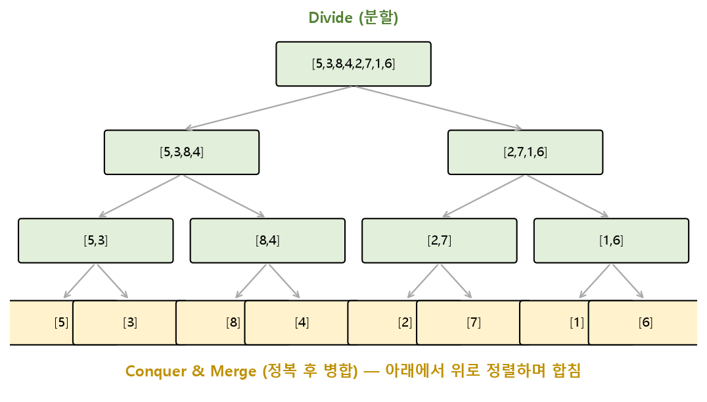

# SW문제해결응용 분할 정복 정리

문제를 더 작은 동일한 형태의 문제로 나누어 해결하는 **분할 정복(Divide and Conquer)** 기법과, 이를 활용한 대표적인 정렬 알고리즘인 **병합 정렬**, **퀵 정렬**을 정리한 문서입니다.

---

## 1. 분할 정복(Divide and Conquer)

### 개념

분할 정복은 다음 3단계로 문제를 해결하는 접근법입니다.

1. **Divide(분할):** 해결할 문제를 여러 개의 더 작은 부분 문제로 나눔
2. **Conquer(정복):** 나누어진 작은 문제를 재귀적으로 해결 (충분히 작아지면 바로 해결)
3. **Combine(결합):** 정복한 부분 문제의 답을 모아서 원래 문제의 답으로 결합

### 분할 정복 vs 동적 계획법(DP)

| 구분 | 분할 정복 | DP |
| --- | --- | --- |
| 부분 문제 | 서로 겹치지 않음(독립적) | 부분 문제가 중복됨 |
| 대표 예 | 병합 정렬, 퀵 정렬 | 피보나치, 배낭 문제 |
| 저장(메모이제이션) | 필요 없음 | 중복 계산을 피하기 위해 필요 |

> 두 기법 모두 "큰 문제를 작은 문제로 나눈다"는 점은 같지만, 분할 정복은 나뉜 부분 문제들이 서로 겹치지 않는다는 점이 DP와의 핵심 차이입니다.

---

## 2. 병합 정렬(Merge Sort)

* 리스트를 절반으로 계속 나누다가(Divide), 더 이상 나눌 수 없을 때(원소 1개)부터 **정렬하며 병합(Merge)** 하는 방식
* **안정 정렬(Stable Sort)**: 같은 값의 상대적인 순서가 유지됨

### 동작 절차

1. 리스트를 절반으로 나눔 (Divide) — 원소가 1개가 될 때까지 재귀적으로 반복
2. 나누어진 두 리스트를 각각 정렬 (Conquer)
3. 정렬된 두 리스트를 하나로 합침 (Merge) — 두 리스트의 맨 앞 원소를 비교하며 더 작은 값을 순서대로 꺼냄



```python
def merge_sort(arr):
    if len(arr) <= 1:
        return arr

    mid = len(arr) // 2
    left = merge_sort(arr[:mid])     # Divide + Conquer (왼쪽)
    right = merge_sort(arr[mid:])    # Divide + Conquer (오른쪽)

    return merge(left, right)         # Combine

def merge(left, right):
    result = []
    i = j = 0
    while i < len(left) and j < len(right):
        if left[i] <= right[j]:
            result.append(left[i]); i += 1
        else:
            result.append(right[j]); j += 1
    result.extend(left[i:])
    result.extend(right[j:])
    return result
```

* 시간복잡도: 분할에 `O(log N)` 단계, 각 단계마다 병합에 `O(N)` → 전체 **`O(N log N)`** (최선/평균/최악 모두 동일)
* 단점: 병합 과정에서 별도의 배열 공간이 필요해 **공간복잡도 `O(N)`**

---

## 3. 퀵 정렬(Quick Sort)

* 리스트에서 **기준값(Pivot)** 을 하나 정하고, 피벗보다 작은 값은 왼쪽, 큰 값은 오른쪽으로 나눈 뒤(Divide), 각각을 재귀적으로 정렬하는 방식
* 병합 정렬과 달리 나누는 과정(Partition) 자체에서 정렬이 진행되므로, **별도의 병합(Combine) 과정이 거의 필요 없음**

### 동작 절차 (Partition)

1. 피벗을 하나 선택 (예: 리스트의 마지막 원소)
2. 피벗보다 작은 값은 왼쪽, 큰 값은 오른쪽으로 이동시켜 피벗을 제자리에 위치시킴
3. 피벗을 기준으로 나뉜 왼쪽/오른쪽 부분 리스트에 대해 재귀적으로 1~2 반복

```python
def quick_sort(arr, start, end):
    if start >= end:
        return
    pivot_idx = partition(arr, start, end)
    quick_sort(arr, start, pivot_idx - 1)   # 피벗 왼쪽 부분 재귀 정렬
    quick_sort(arr, pivot_idx + 1, end)     # 피벗 오른쪽 부분 재귀 정렬

def partition(arr, start, end):
    pivot = arr[end]
    i = start - 1
    for j in range(start, end):
        if arr[j] < pivot:
            i += 1
            arr[i], arr[j] = arr[j], arr[i]
    arr[i + 1], arr[end] = arr[end], arr[i + 1]
    return i + 1   # 피벗이 자리 잡은 최종 인덱스
```

* 평균 시간복잡도: **`O(N log N)`**
* 최악의 경우(이미 정렬된 배열에서 항상 끝/처음을 피벗으로 선택하는 경우 등) `O(N^2)`까지 느려질 수 있음 → 피벗을 무작위로 선택하거나 중간값을 사용해 완화
* 병합 정렬과 달리 대부분 **제자리(In-place) 정렬**로 구현되어 추가 메모리 사용이 적음

### 병합 정렬 vs 퀵 정렬

| 구분 | 병합 정렬 | 퀵 정렬 |
| --- | --- | --- |
| 분할 기준 | 항상 정확히 절반 | 피벗값 기준 (불균등할 수 있음) |
| 정렬 시점 | 병합(Combine) 단계에서 정렬 | 분할(Partition) 단계에서 정렬 |
| 안정성 | 안정 정렬(Stable) | 불안정 정렬(Unstable) |
| 시간복잡도 | 항상 `O(N log N)` | 평균 `O(N log N)`, 최악 `O(N^2)` |
| 공간복잡도 | `O(N)` (추가 배열 필요) | `O(log N)` (재귀 스택, in-place) |

---

## 핵심 요약
* **분할 정복**은 문제를 서로 겹치지 않는 작은 부분 문제로 나누어(Divide) 재귀적으로 해결(Conquer)한 뒤 결과를 합치는(Combine) 접근법으로, 부분 문제가 중복되는 DP와 구분된다.
* **병합 정렬**은 절반으로 나누는 분할 자체는 균등하지만 병합 단계에서 정렬이 이루어지며, 항상 `O(N log N)`을 보장하는 대신 `O(N)`의 추가 공간이 필요하다.
* **퀵 정렬**은 피벗을 기준으로 나누는 분할(Partition) 단계에서 정렬이 진행되며, 평균 `O(N log N)`으로 빠르고 제자리 정렬이 가능하지만 피벗 선택이 나쁘면 최악 `O(N^2)`까지 느려질 수 있다.
