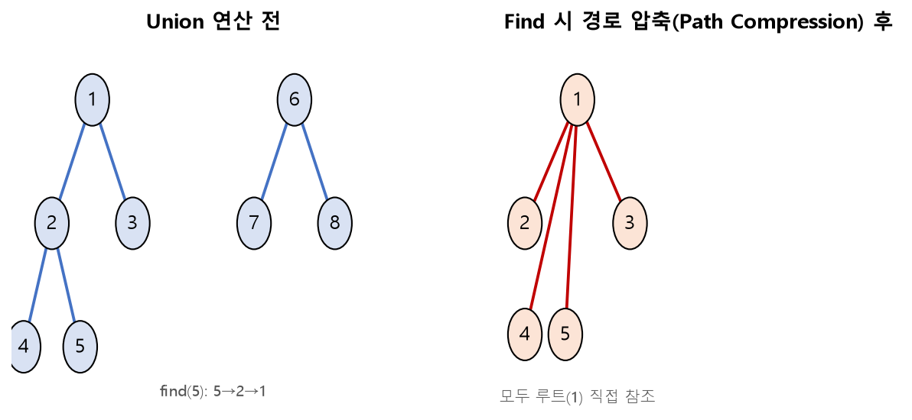

# SW문제해결응용 서로소 집합 정리

서로 중복되지 않는 부분집합들로 나누어진 원소들에 대한 정보를 표현하고 조작하는 자료구조인 **서로소 집합(Disjoint Set, Union-Find)** 과, 이를 최적화하는 기법, 관련 문제풀이를 정리한 문서입니다.

---

## 1. 서로소 집합(Disjoint Set)

### 개념

* 서로소 집합(상호배타 집합)이란 **교집합이 없는(공통 원소가 없는)** 집합들을 의미
* 즉, 하나의 원소는 오직 하나의 집합에만 속함
* 대표적인 예: 그래프의 **연결 요소(Connected Component)** 찾기, 무방향 그래프에서의 **사이클 판별**

### 표현 방법 — 트리(Tree)를 이용한 표현

* 서로소 집합에 속한 원소들을 하나의 트리로 표현
* 각 트리의 **루트 노드**를 그 집합의 대표자(representative)로 삼음

### 주요 연산

| 연산 | 설명 |
| --- | --- |
| **Make-Set(x)** | 원소 x만 포함하는 새로운 집합을 생성 (자기 자신을 부모로 설정) |
| **Union(x, y)** | x가 속한 집합과 y가 속한 집합을 하나로 합침 |
| **Find(x)** | x가 속한 집합의 대표자(루트)를 찾음 |

```python
parent = list(range(N + 1))   # Make-Set: 초기에는 자기 자신이 곧 루트

def find(x):
    if parent[x] == x:
        return x
    return find(parent[x])

def union(x, y):
    root_x = find(x)
    root_y = find(y)
    if root_x != root_y:
        parent[root_x] = root_y   # 한 쪽 루트를 다른 쪽 루트 밑으로 붙임
```

* **사이클 판별:** 간선 `(u, v)`를 union하기 전에 `find(u) == find(v)`라면 두 정점이 이미 같은 집합(트리)에 속해 있다는 뜻이므로, 이 간선을 추가하면 사이클이 생김

---

## 2. 서로소 집합 최적화

기본 구현은 트리가 한쪽으로 길게 늘어질 경우(편향 트리) `find` 연산이 `O(N)`까지 느려질 수 있습니다. 이를 해결하기 위한 두 가지 대표적 최적화 기법이 있습니다.

### 1) Union-by-Rank (Union-by-Size)

* 항상 **높이(또는 크기)가 더 작은 트리를 더 큰 트리 밑에 붙여서** 트리의 높이가 급격히 커지는 것을 방지

```python
rank = [0] * (N + 1)

def union(x, y):
    root_x, root_y = find(x), find(y)
    if root_x == root_y:
        return
    if rank[root_x] < rank[root_y]:
        root_x, root_y = root_y, root_x
    parent[root_y] = root_x
    if rank[root_x] == rank[root_y]:
        rank[root_x] += 1
```

### 2) Path Compression (경로 압축)

* `find` 연산 수행 중 거쳐 간 모든 노드가, 매번 루트까지 재탐색하지 않도록 **직접 루트를 가리키게** 갱신
* 한 번 `find`가 호출된 이후에는 해당 경로상의 노드들이 압축되어, 이후의 `find` 연산이 거의 `O(1)`에 가까워짐

```python
def find(x):
    if parent[x] != x:
        parent[x] = find(parent[x])   # 재귀적으로 찾은 루트를 바로 부모로 설정 (경로 압축)
    return parent[x]
```



* 두 최적화(Union-by-Rank + Path Compression)를 함께 사용하면 `Union`/`Find` 연산의 시간복잡도가 **거의 상수 시간(Amortized O(α(N)), 애커만 함수의 역함수)** 에 가까워짐

---

## 3. 문제풀이 — 14163. 그룹 나누기

* N명의 학생 사이에 친구 관계 정보가 여러 개 주어질 때, 몇 개의 친구 그룹(연결 요소)으로 나뉘는지 구하는 문제
* 학생 간의 관계를 간선으로 보고, 모든 관계에 대해 `union` 연산을 수행한 뒤 **서로 다른 루트(대표자)의 개수**를 세면 그룹의 개수가 됨

```python
for u, v in friend_relations:
    union(u, v)

roots = set(find(i) for i in range(1, N + 1))
print(len(roots))   # 그룹(연결 요소)의 개수
```

---

## 핵심 요약
* **서로소 집합(Disjoint Set)** 은 교집합이 없는 집합들을 트리로 표현하는 자료구조로, `Make-Set`/`Union`/`Find` 세 가지 연산으로 조작하며 사이클 판별·그룹(연결 요소) 판별에 활용된다.
* 기본 구현은 트리가 편향될 경우 `find`가 `O(N)`까지 느려질 수 있어, **Union-by-Rank**(작은 트리를 큰 트리 밑에 붙임)와 **Path Compression**(찾은 경로를 압축해 루트를 직접 참조)로 최적화한다.
* 두 최적화를 함께 적용하면 연산이 거의 상수 시간에 가까워지며, **14163. 그룹 나누기**처럼 모든 관계에 union을 수행한 뒤 서로 다른 루트의 개수를 세어 그룹 수를 구하는 문제에 바로 활용할 수 있다.
