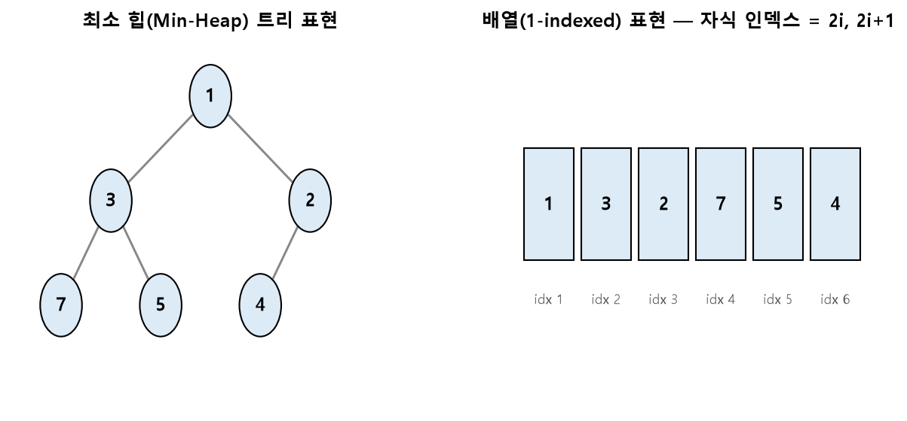

# SW문제해결응용 이진탐색 / 힙 정리

정렬된 자료를 빠르게 검색하기 위한 **이진 탐색 트리(BST)** 와, 최댓값·최솟값을 빠르게 꺼내기 위한 완전 이진 트리 기반 자료구조 **힙(Heap)** 을 정리한 문서입니다.

---

## 1. BST (이진 탐색 트리, Binary Search Tree)

### 정의

* 모든 노드가 다음 조건을 만족하는 이진 트리
  * **왼쪽 서브트리**의 모든 노드 값은 현재 노드보다 **작다**
  * **오른쪽 서브트리**의 모든 노드 값은 현재 노드보다 **크다**
  * 왼쪽/오른쪽 서브트리도 각각 BST 조건을 만족 (재귀적 정의)
* 이 성질 덕분에 **중위 순회(In-order Traversal)** 를 하면 오름차순으로 정렬된 값을 얻을 수 있음

### 주요 연산

```python
class Node:
    def __init__(self, key):
        self.key = key
        self.left = None
        self.right = None

def insert(root, key):
    if root is None:
        return Node(key)
    if key < root.key:
        root.left = insert(root.left, key)
    else:
        root.right = insert(root.right, key)
    return root

def search(root, key):
    if root is None or root.key == key:
        return root
    if key < root.key:
        return search(root.left, key)
    return search(root.right, key)
```

* **탐색/삽입/삭제 평균 시간복잡도:** `O(log N)` — 트리의 높이만큼만 비교하면 되기 때문
* **최악의 경우:** 데이터가 정렬된 순서로 삽입되어 트리가 한쪽으로 편향(Skewed)되면 `O(N)`까지 느려질 수 있음 (이를 개선한 것이 AVL 트리, 레드-블랙 트리 등의 **균형 이진 탐색 트리**)

### 삭제 연산의 세 가지 경우

| 경우 | 처리 방법 |
| --- | --- |
| 리프 노드(자식 없음) | 그냥 삭제 |
| 자식이 하나 | 자식 노드를 그 자리로 올림 |
| 자식이 둘 | 오른쪽 서브트리에서 가장 작은 값(또는 왼쪽에서 가장 큰 값)으로 대체 후, 그 노드를 삭제 |

---

## 2. Heap (힙)

### 정의

* **완전 이진 트리(Complete Binary Tree)** 형태를 가지면서, 부모-자식 간에 대소 관계가 일정하게 유지되는 자료구조
* **최소 힙(Min-Heap):** 부모 노드의 값이 항상 자식 노드보다 **작거나 같음** → 루트가 항상 최솟값
* **최대 힙(Max-Heap):** 부모 노드의 값이 항상 자식 노드보다 **크거나 같음** → 루트가 항상 최댓값
* BST와 달리 **좌우 자식 간의 크기 순서는 정해져 있지 않음** (오직 부모-자식 관계만 성립)

### 배열로 표현하기

힙은 **완전 이진 트리**이므로 배열(리스트) 하나로 효율적으로 표현할 수 있습니다. (1-indexed 기준)

* 부모의 인덱스가 `i`일 때, 왼쪽 자식은 `2i`, 오른쪽 자식은 `2i+1`
* 자식의 인덱스가 `i`일 때, 부모는 `i // 2`



### 삽입(Push) — 마지막에 추가 후 위로 올리기(Up-heapify)

1. 힙의 맨 끝(배열의 마지막)에 새 원소를 추가
2. 부모 노드와 비교하여, 힙의 조건을 어기면 부모와 위치를 교환
3. 조건을 만족할 때까지(또는 루트에 도달할 때까지) 반복

### 삭제(Pop) — 루트 제거 후 마지막 원소를 올려 내리기(Down-heapify)

1. 루트(최솟값/최댓값)를 반환할 결과로 저장
2. 배열의 마지막 원소를 루트 자리로 이동
3. 자식들과 비교하여 힙 조건을 어기면 **더 작은(또는 더 큰) 자식**과 교환
4. 조건을 만족할 때까지 반복

```python
import heapq

heap = []
heapq.heappush(heap, 5)   # 삽입 (Up-heapify)
heapq.heappush(heap, 1)
heapq.heappush(heap, 3)

smallest = heapq.heappop(heap)   # 삭제, 최솟값 반환 (Down-heapify)
```

* 파이썬의 `heapq`는 기본적으로 **최소 힙**만 제공하며, 최대 힙이 필요하면 값을 음수로 바꿔서 사용
* 삽입/삭제 모두 트리의 높이만큼만 이동하므로 시간복잡도는 **`O(log N)`**

### BST vs Heap

| 구분 | BST | Heap |
| --- | --- | --- |
| 구조 | 이진 탐색 트리(균형 무보장) | 완전 이진 트리 |
| 정렬 관계 | 왼쪽 < 부모 < 오른쪽 | 부모 ≤(또는 ≥) 자식 (좌우 순서 없음) |
| 주 용도 | 특정 값의 탐색, 범위 검색 | 최솟값/최댓값을 빠르게 꺼내기 (우선순위 큐) |
| 대표 시간복잡도 | 평균 `O(log N)`, 최악 `O(N)` | 삽입/삭제 `O(log N)` |

---

## 핵심 요약
* **BST**는 왼쪽 서브트리 < 부모 < 오른쪽 서브트리라는 정렬 성질을 가진 트리로, 평균 `O(log N)`에 탐색/삽입/삭제가 가능하지만 편향되면 `O(N)`까지 느려질 수 있다.
* **힙**은 완전 이진 트리이면서 부모-자식 간 대소 관계(최소 힙/최대 힙)만 유지하는 자료구조로, 배열 하나로 표현 가능하며(`2i`, `2i+1`) 최솟값/최댓값을 항상 `O(1)`에 확인하고 `O(log N)`에 꺼낼 수 있다.
* BST는 "특정 값 찾기"에, 힙은 "가장 작은/큰 값을 반복적으로 꺼내는 우선순위 큐"에 적합하다는 점에서 용도가 다르다.
