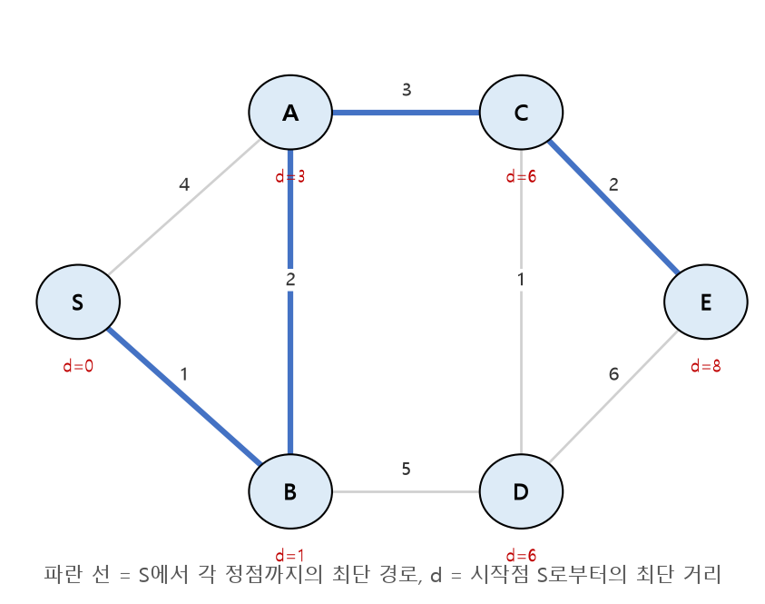

# SW문제해결응용 최단경로 정리

그래프에서 한 정점으로부터 다른 정점까지의 **가장 짧은 경로**를 구하는 대표적인 세 가지 알고리즘, **다익스트라(Dijkstra)**, **벨만-포드(Bellman-Ford)**, **플로이드-워셜(Floyd-Warshall)** 을 정리한 문서입니다.

---

## 1. 다익스트라(Dijkstra) 알고리즘

* **하나의 시작 정점**에서 다른 모든 정점까지의 최단 경로를 구하는 알고리즘 (Single-Source Shortest Path)
* **음수 가중치가 없는** 그래프에서 사용 (탐욕(Greedy) 알고리즘 기반)
* 시작 정점에서 가장 가까운 정점을 확정하고, 그 정점을 거쳐 갈 수 있는 다른 정점까지의 거리를 갱신하는 과정을 반복

### 동작 절차

1. 시작 정점의 거리를 0, 나머지 정점의 거리를 무한대(∞)로 초기화
2. 방문하지 않은 정점 중 **거리가 가장 짧은 정점**을 선택
3. 그 정점을 거쳐 인접 정점으로 가는 거리를 계산하여, 기존 거리보다 짧으면 **갱신(Relaxation)**
4. 모든 정점을 방문할 때까지 2~3 반복

```python
import heapq

def dijkstra(start, N, graph):
    dist = [float("inf")] * (N + 1)
    dist[start] = 0
    pq = [(0, start)]   # (거리, 정점)

    while pq:
        cur_dist, node = heapq.heappop(pq)
        if cur_dist > dist[node]:      # 이미 더 짧은 거리로 처리된 경우 skip
            continue
        for next_node, weight in graph[node]:
            new_dist = cur_dist + weight
            if new_dist < dist[next_node]:   # Relaxation
                dist[next_node] = new_dist
                heapq.heappush(pq, (new_dist, next_node))
    return dist
```



* 우선순위 큐(Min-Heap)를 사용하면 시간복잡도 `O(E log V)`로 효율적으로 구현 가능

---

## 2. 벨만-포드(Bellman-Ford) 알고리즘

* 다익스트라와 마찬가지로 **하나의 시작 정점**에서 다른 모든 정점까지의 최단 경로를 구함
* 다익스트라와 달리 **음수 가중치가 있는 그래프에서도 사용 가능**
* 모든 간선을 `V-1`번 반복하여 완화(Relaxation)하는 방식

```python
def bellman_ford(start, N, edges):
    dist = [float("inf")] * (N + 1)
    dist[start] = 0

    for _ in range(N - 1):                    # 정점 수 - 1번 반복
        for u, v, w in edges:
            if dist[u] != float("inf") and dist[u] + w < dist[v]:
                dist[v] = dist[u] + w

    # 음수 사이클 탐지: 한 번 더 반복했을 때 값이 갱신되면 음수 사이클 존재
    for u, v, w in edges:
        if dist[u] != float("inf") and dist[u] + w < dist[v]:
            return None   # 음수 사이클 존재 → 최단 경로 정의 불가

    return dist
```

* 최단 경로는 최대 `V-1`개의 간선으로 구성되므로, 모든 간선에 대해 `V-1`번 완화를 반복하면 최단 거리가 확정됨
* `V-1`번 반복 후에도 거리가 갱신된다면 **음수 사이클(Negative Cycle)** 이 존재한다는 의미이며, 이 경우 최단 경로가 정의되지 않음
* 시간복잡도 `O(V·E)`로 다익스트라보다 느리지만, 음수 간선을 다룰 수 있다는 장점이 있음

---

## 3. 플로이드-워셜(Floyd-Warshall) 알고리즘

* **모든 정점 쌍**에 대한 최단 경로를 한 번에 구하는 알고리즘 (All-Pairs Shortest Path)
* 다이나믹 프로그래밍(DP) 기반: `k`를 거쳐 가는 경로가 더 짧아지는지를 모든 정점 쌍에 대해 갱신
* 음수 가중치는 허용하지만(음수 사이클은 불가), 정점 수가 많아지면(`O(V^3)`) 비효율적

```python
INF = float("inf")

def floyd_warshall(N, dist):
    # dist[i][j] : i에서 j로 가는 초기 간선 가중치 (없으면 INF, dist[i][i] = 0)
    for k in range(1, N + 1):          # 경유지 k
        for i in range(1, N + 1):      # 출발지 i
            for j in range(1, N + 1):  # 도착지 j
                if dist[i][k] + dist[k][j] < dist[i][j]:
                    dist[i][j] = dist[i][k] + dist[k][j]
    return dist
```

* 점화식: `dist[i][j] = min(dist[i][j], dist[i][k] + dist[k][j])`
* "정점 `k`를 경유하는 것이 직접 가는 것보다 빠른가?"를 모든 `(i, j)` 쌍에 대해 확인하는 것이 핵심

---

## 4. 세 알고리즘 비교

| 구분 | Dijkstra | Bellman-Ford | Floyd-Warshall |
| --- | --- | --- | --- |
| 최단 경로 범위 | 한 정점 → 전체 | 한 정점 → 전체 | 모든 정점 쌍 |
| 음수 가중치 | 불가 | 가능 (음수 사이클 탐지 가능) | 가능 (음수 사이클 불가) |
| 방식 | 탐욕(Greedy) + 우선순위 큐 | 모든 간선 V-1회 완화 | DP (경유지 기준 갱신) |
| 시간복잡도 | `O(E log V)` | `O(V·E)` | `O(V^3)` |

---

## 핵심 요약
* **다익스트라**는 음수 가중치가 없는 그래프에서, 매번 가장 가까운 정점을 확정해 나가는 탐욕 기반의 단일 시작점 최단 경로 알고리즘이다.
* **벨만-포드**는 모든 간선을 `V-1`번 완화(Relaxation)하는 방식으로 음수 가중치를 다룰 수 있으며, 추가로 한 번 더 완화해 값이 바뀌면 음수 사이클을 탐지할 수 있다.
* **플로이드-워셜**은 "정점 k를 경유하는 것이 더 빠른가?"를 모든 정점 쌍에 대해 갱신하는 DP 기반 알고리즘으로, 모든 쌍의 최단 경로를 `O(V^3)`에 한 번에 구한다.
* 그래프의 크기, 음수 가중치 여부, 필요한 최단 경로의 범위(단일 시작점 vs 모든 쌍)에 따라 적절한 알고리즘을 선택해야 한다.
