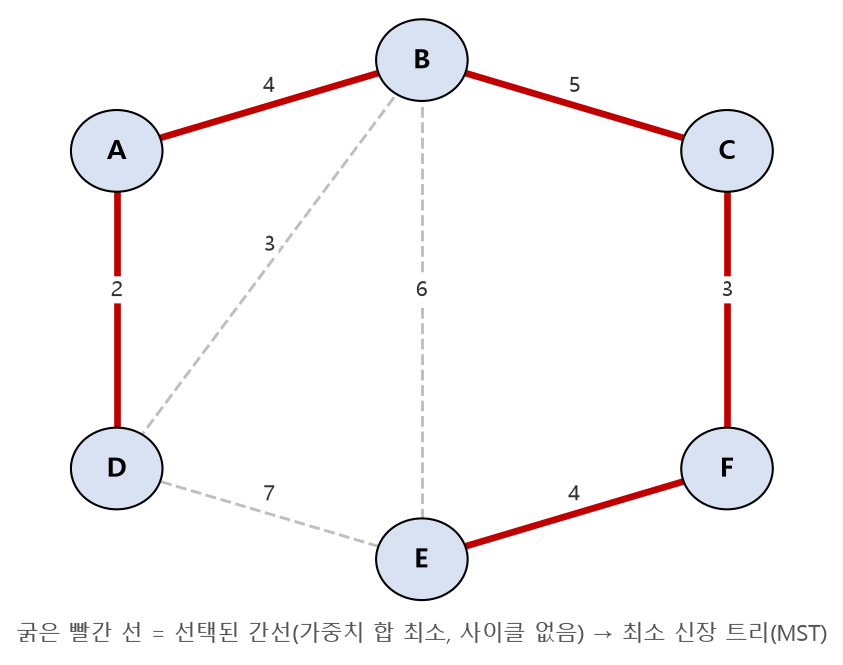

# SW문제해결응용 최소신장트리 정리

그래프의 모든 정점을 **최소 비용으로, 사이클 없이** 연결하는 **최소 신장 트리(MST, Minimum Spanning Tree)** 의 개념과, 이를 구하는 대표 알고리즘인 **Kruskal**과 **Prim**을 정리한 문서입니다.

---

## 1. 개요 — 신장 트리와 최소 신장 트리

### 신장 트리(Spanning Tree)

* 그래프 내의 모든 정점을 포함하면서, 사이클 없이 정점들을 연결한 부분 그래프(Tree)
* `N`개의 정점을 가진 그래프의 신장 트리는 항상 `N-1`개의 간선을 가짐
* 하나의 그래프에서 신장 트리는 여러 개 존재할 수 있음

### 최소 신장 트리(MST)

* 여러 개의 신장 트리 중에서, **간선 가중치의 합이 최소**가 되는 신장 트리
* **활용 예:** 도로/통신망을 최소 비용으로 모두 연결하기, 전선 부설 최소화 등
* 대표 알고리즘: **Kruskal 알고리즘**, **Prim 알고리즘** (둘 다 탐욕(Greedy) 알고리즘에 속함)

---

## 2. Kruskal 알고리즘 — 간선 중심

* 모든 간선을 **가중치 오름차순으로 정렬**한 뒤, 사이클을 만들지 않는 간선을 하나씩 선택해 나가는 방식
* 사이클 판별에는 **서로소 집합(Union-Find)** 을 사용

### 동작 절차

1. 모든 간선을 가중치 기준 오름차순 정렬
2. 가중치가 작은 간선부터 순서대로 확인
3. 간선의 두 정점이 **이미 같은 집합(트리)** 이면 → 사이클이 생기므로 선택하지 않고 넘어감
4. 서로 다른 집합이면 → 간선을 선택(MST에 포함)하고 두 집합을 union
5. 선택한 간선이 `N-1`개가 되면 종료

```python
def kruskal(N, edges):
    parent = list(range(N + 1))

    def find(x):
        if parent[x] != x:
            parent[x] = find(parent[x])
        return parent[x]

    edges.sort(key=lambda e: e[2])   # (u, v, weight) 기준 가중치 오름차순 정렬
    mst_weight = 0
    cnt = 0
    for u, v, w in edges:
        if find(u) != find(v):        # 사이클이 생기지 않을 때만 선택
            parent[find(u)] = find(v)
            mst_weight += w
            cnt += 1
            if cnt == N - 1:
                break
    return mst_weight
```



---

## 3. Prim 알고리즘 — 정점 중심

* 임의의 **정점 하나에서 시작**해, 이미 선택된 정점들의 집합과 연결된 간선 중 **가장 가중치가 작은 간선**을 하나씩 선택하며 트리를 확장해 나가는 방식
* 우선순위 큐(Min-Heap)를 사용하면 효율적으로 구현 가능

### 동작 절차

1. 시작 정점을 방문 처리하고 트리에 포함
2. 트리에 포함된 정점들과 연결된 간선 중, 아직 트리에 없는 정점으로 가는 **최소 가중치 간선**을 선택
3. 새로 선택된 정점을 트리에 추가
4. 모든 정점이 트리에 포함될 때까지 2~3 반복

```python
import heapq

def prim(N, graph, start=1):
    visited = [False] * (N + 1)
    pq = [(0, start)]   # (가중치, 정점)
    mst_weight = 0

    while pq:
        weight, node = heapq.heappop(pq)
        if visited[node]:
            continue
        visited[node] = True
        mst_weight += weight
        for next_node, next_weight in graph[node]:
            if not visited[next_node]:
                heapq.heappush(pq, (next_weight, next_node))
    return mst_weight
```

### Kruskal vs Prim

| 구분 | Kruskal | Prim |
| --- | --- | --- |
| 접근 방식 | 간선 중심 (가중치가 작은 간선부터) | 정점 중심 (연결된 정점을 확장) |
| 자료구조 | 서로소 집합(Union-Find) | 우선순위 큐(Min-Heap) |
| 유리한 그래프 | 간선이 적은(Sparse) 그래프 | 간선이 많은(Dense) 그래프 |
| 시간복잡도 | `O(E log E)` (간선 정렬) | `O(E log V)` (힙 연산) |

---

## 핵심 요약
* **최소 신장 트리(MST)** 는 그래프의 모든 정점을 사이클 없이, 최소 비용으로 연결하는 신장 트리이며 정점이 `N`개면 항상 `N-1`개의 간선으로 구성된다.
* **Kruskal 알고리즘**은 간선을 가중치 오름차순으로 정렬한 뒤, 서로소 집합으로 사이클 여부를 판별하며 간선을 하나씩 선택하는 **간선 중심** 탐욕 알고리즘이다.
* **Prim 알고리즘**은 시작 정점에서부터 우선순위 큐를 이용해 연결된 간선 중 최소 가중치 간선을 선택하며 트리를 확장하는 **정점 중심** 탐욕 알고리즘이다.
* 두 알고리즘 모두 MST를 정확히 구하지만, 간선이 적은 그래프에는 Kruskal이, 간선이 많은 그래프에는 Prim이 일반적으로 더 유리하다.
