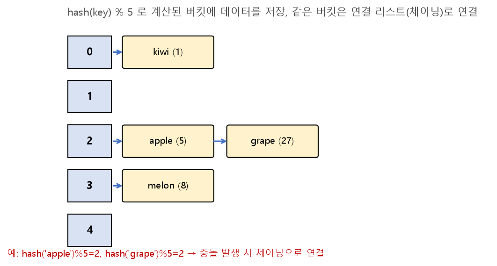

# SW문제해결응용 해시 정리

키(Key)를 값(Value)에 빠르게 대응시키는 자료구조인 **해시(Hash)** 의 개념과, 해시 값을 만드는 **해시 함수**, 서로 다른 키가 같은 위치로 매핑될 때 발생하는 **해시 충돌**과 그 해결 방법을 정리한 문서입니다.

---

## 1. 해시(Hash)란?

* 임의의 크기를 가진 데이터를 **고정된 크기의 값(해시값)** 으로 매핑하는 것
* 이 해시값을 배열의 인덱스로 사용하면, 데이터의 **저장/탐색/삭제를 평균 `O(1)`** 에 수행할 수 있음
* 배열은 인덱스를 알아야만 `O(1)` 접근이 가능하지만, 해시 테이블은 **키(key) 자체로부터 인덱스를 계산**하기 때문에 이름/문자열 같은 임의의 키로도 빠르게 데이터를 찾을 수 있음

### 관련 용어

| 용어 | 설명 |
| --- | --- |
| **해시 테이블(Hash Table)** | 키-값 쌍을 저장하는 자료구조 (배열 기반) |
| **해시 함수(Hash Function)** | 키를 해시값(배열의 인덱스)으로 변환하는 함수 |
| **버킷(Bucket) / 슬롯(Slot)** | 해시 테이블에서 실제 데이터가 저장되는 각 공간 |
| **해시 충돌(Collision)** | 서로 다른 키가 같은 해시값(인덱스)으로 계산되는 상황 |

---

## 2. 해시 함수

좋은 해시 함수는 키들을 **가능한 한 균일하게(Uniform)** 분산시켜 충돌을 최소화해야 합니다.

### 대표적인 해시 함수 기법

* **나눗셈법(Division Method):** `hash(key) = key % table_size` — 가장 간단하고 널리 사용됨 (테이블 크기를 소수로 잡으면 충돌이 더 고르게 분산되는 경향이 있음)
* **곱셈법(Multiplication Method):** 키에 특정 상수를 곱한 값의 소수 부분을 이용해 인덱스를 계산
* **문자열 해싱:** 문자열의 각 문자를 아스키 코드값으로 변환한 뒤, 특정 진법(base)의 다항식처럼 계산 (예: 라빈-카프에서 사용한 방식과 동일한 원리)

```python
def string_hash(s, table_size):
    h = 0
    for ch in s:
        h = (h * 31 + ord(ch)) % table_size   # 31 등 소수를 base로 사용
    return h
```

---

## 3. 해시 충돌(Collision)과 해결 방법

**비둘기집 원리**에 의해, 키의 개수가 테이블 크기보다 많아지면 충돌은 필연적으로 발생합니다. 대표적인 해결 방법은 다음 두 가지입니다.

### 1) 체이닝(Chaining) — 개방 해싱(Open Hashing)

* 같은 버킷에 여러 데이터가 몰리면, 그 버킷에 **연결 리스트(Linked List)** 로 데이터를 이어서 저장
* 버킷이 가득 차더라도 계속 이어붙일 수 있어 **테이블 크기 이상으로 데이터를 저장 가능**



```python
class HashTable:
    def __init__(self, size):
        self.size = size
        self.table = [[] for _ in range(size)]   # 각 버킷을 리스트로 초기화

    def _hash(self, key):
        return hash(key) % self.size

    def insert(self, key, value):
        idx = self._hash(key)
        for pair in self.table[idx]:
            if pair[0] == key:
                pair[1] = value    # 이미 있는 키면 값만 갱신
                return
        self.table[idx].append([key, value])   # 충돌 시 리스트에 이어붙임

    def get(self, key):
        idx = self._hash(key)
        for k, v in self.table[idx]:
            if k == key:
                return v
        return None
```

### 2) 개방 주소법(Open Addressing) — 폐쇄 해싱(Closed Hashing)

* 충돌이 발생하면, **정해진 규칙에 따라 다른 빈 버킷을 찾아** 그곳에 데이터를 저장
* 별도의 연결 리스트 없이 테이블 배열 하나만으로 구현 가능하지만, 테이블 크기 이상으로는 저장할 수 없음

| 방식 | 다음 버킷을 찾는 방법 |
| --- | --- |
| **선형 조사법(Linear Probing)** | 충돌 시 바로 다음 인덱스(`+1, +2, ...`)를 순서대로 확인 |
| **이차 조사법(Quadratic Probing)** | 충돌 시 `+1², +2², +3², ...` 간격으로 확인 (선형 조사의 군집화 문제 완화) |
| **이중 해싱(Double Hashing)** | 두 번째 해시 함수로 건너뛸 간격 자체를 다시 계산 |

```python
def linear_probing_insert(table, key, value):
    size = len(table)
    idx = hash(key) % size
    for i in range(size):                 # 최대 size번까지 다음 자리를 탐색
        probe = (idx + i) % size
        if table[probe] is None:
            table[probe] = (key, value)
            return
    raise Exception("Hash Table is full")
```

### 체이닝 vs 개방 주소법

| 구분 | 체이닝 | 개방 주소법 |
| --- | --- | --- |
| 충돌 처리 | 같은 버킷에 연결 리스트로 추가 | 다른 빈 버킷을 탐색해 저장 |
| 최대 저장 개수 | 테이블 크기 제한 없음 | 테이블 크기 이하로 제한 |
| 메모리 | 리스트 노드만큼 추가 사용 | 배열만 사용 (추가 구조 없음) |
| 삭제 | 리스트에서 노드만 제거하면 됨 | 삭제 시 탐색 경로가 끊기지 않도록 별도 처리 필요 |

---

## 핵심 요약
* **해시**는 키를 해시 함수를 통해 고정된 크기의 인덱스로 변환해, 평균 `O(1)`에 데이터를 저장/탐색하는 자료구조이다.
* 좋은 **해시 함수**는 키를 테이블 전체에 고르게 분산시켜야 하며, 나눗셈법(`key % size`)이 가장 널리 쓰인다.
* 서로 다른 키가 같은 인덱스로 매핑되는 **해시 충돌**은 필연적으로 발생하며, 같은 버킷을 연결 리스트로 잇는 **체이닝**과 다른 빈 자리를 찾아 저장하는 **개방 주소법(선형/이차 조사, 이중 해싱)** 두 가지 방식으로 해결한다.
