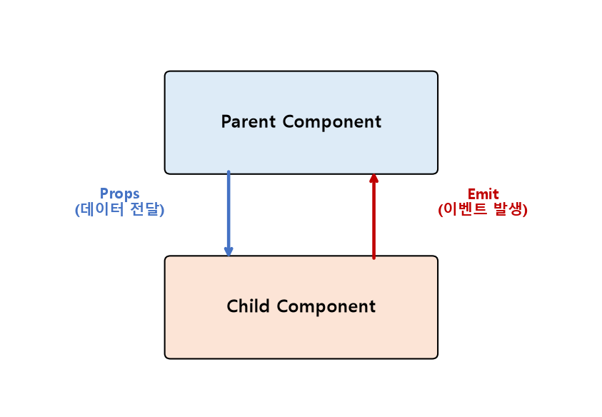

# Vue Component State Flow 정리

부모 컴포넌트가 자식 컴포넌트에게 데이터를 전달하는 **Passing Props**와, 반대로 자식이 부모에게 상황을 알리는 **Component Event**를 정리한 문서입니다.

---

## 1. Passing Props — 부모 → 자식

* **Props:** 부모 컴포넌트가 자식 컴포넌트에게 전달하는 읽기 전용 데이터

```vue
<!-- 자식 컴포넌트: ArticleCard.vue -->
<script setup>
defineProps({
    title: { type: String, required: true },
    likeCount: { type: Number, default: 0 },
});
</script>

<template>
  <div class="card">
    <h3>{{ title }}</h3>
    <p>좋아요: {{ likeCount }}</p>
  </div>
</template>
```

```vue
<!-- 부모 컴포넌트 -->
<template>
  <ArticleCard
    v-for="article in articles"
    :key="article.id"
    :title="article.title"
    :like-count="article.likeCount"
  />
</template>
```



* Props는 **단방향(One-way)** 으로만 흐름 — 자식 컴포넌트에서 전달받은 props 값을 직접 변경하려고 하면 Vue가 경고를 표시함 (자식이 값을 바꿔야 한다면, 이벤트를 emit해서 부모가 원본 데이터를 변경하도록 해야 함)

---

## 2. Component Event — 자식 → 부모

* 자식 컴포넌트는 `emit`을 통해 **"이런 일이 일어났다"** 는 이벤트를 부모에게 알릴 수 있음 (데이터 자체가 아니라 이벤트 발생을 전달)

```vue
<!-- 자식 컴포넌트: LikeButton.vue -->
<script setup>
const emit = defineEmits(["like"]);   // 이 컴포넌트가 발생시킬 수 있는 이벤트 이름 선언

function handleClick() {
    emit("like", { articleId: props.articleId });   // 이벤트 이름과 함께 데이터도 전달 가능
}
</script>

<template>
  <button @click="handleClick">좋아요</button>
</template>
```

```vue
<!-- 부모 컴포넌트 -->
<template>
  <LikeButton :article-id="article.id" @like="handleLike" />
</template>

<script setup>
function handleLike(payload) {
    console.log(`${payload.articleId}번 게시글에 좋아요`);
    // 실제 상태(부모가 들고 있는 좋아요 개수 등)를 여기서 변경
}
</script>
```

### Props Down, Events Up

* Vue(및 대부분의 컴포넌트 기반 프레임워크)의 데이터 흐름 원칙: **"데이터는 위에서 아래로(Props), 이벤트는 아래에서 위로(Emit)"**
* 이 원칙 덕분에 데이터가 항상 한 방향으로만 흐르므로(단방향 데이터 흐름), 상태가 어디서 왜 바뀌었는지 추적하기 쉬워짐

---

## 핵심 요약
* **Props**는 부모가 자식에게 데이터를 전달하는 단방향 통로이며, 자식은 전달받은 props 값을 직접 변경할 수 없다.
* **Emit**은 자식이 부모에게 특정 사건이 발생했음을 알리는 통로로, 실제 상태 변경은 이벤트를 받은 부모 쪽에서 처리한다.
* "Props Down, Events Up" 원칙에 따라 데이터와 이벤트가 각각 정해진 방향으로만 흐르기 때문에, 컴포넌트 간 상태 흐름을 예측 가능하고 추적하기 쉽게 유지할 수 있다.
