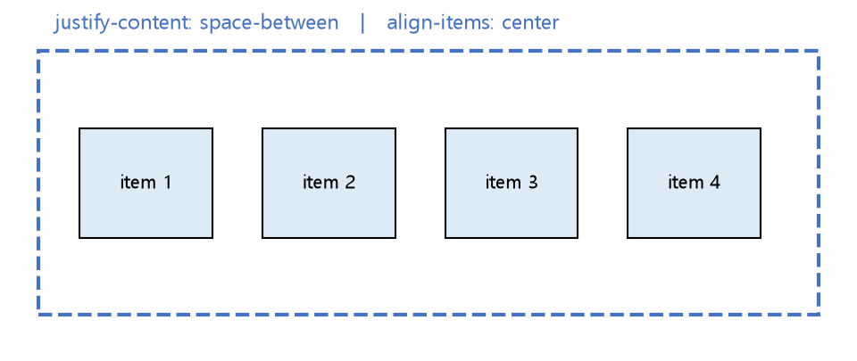

# Web CSS Layout 정리

CSS Box Model을 복습하고, 요소를 원하는 위치에 배치하는 **CSS Position**, 그리고 요소들을 한 줄/한 열로 유연하게 배치하는 **CSS Flexbox**를 정리한 문서입니다.

---

## 1. CSS Box Model 복습

* 모든 요소는 **Content - Padding - Border - Margin** 4단 구조의 박스로 렌더링됨
* `display` 속성에 따라 박스가 배치되는 기본 방식이 달라짐

| display 값 | 특징 |
| --- | --- |
| `block` | 한 줄을 전부 차지, width/height 지정 가능 (`div`, `p` 등 기본값) |
| `inline` | 내용 크기만큼만 차지, width/height 지정 불가 (`span`, `a` 등 기본값) |
| `inline-block` | inline처럼 배치되지만 width/height 지정 가능 |
| `none` | 화면에 렌더링되지 않음 (공간도 차지하지 않음) |

---

## 2. CSS Position

`position` 속성은 요소를 문서의 일반적인 흐름(Normal Flow)에서 벗어나 원하는 위치에 배치할 때 사용합니다.

| 값 | 설명 |
| --- | --- |
| `static` | 기본값. 일반적인 문서 흐름을 따름 (`top/left` 등 무시됨) |
| `relative` | 자기 자신의 원래 위치를 기준으로 이동. **원래 자리는 그대로 차지**함 |
| `absolute` | 가장 가까운 `position`이 지정된 조상 요소를 기준으로 배치. 문서 흐름에서 **제외**됨 |
| `fixed` | 뷰포트(브라우저 화면) 기준으로 고정. 스크롤해도 위치 고정 |
| `sticky` | 스크롤 위치에 따라 `relative`처럼 있다가 특정 지점부터 `fixed`처럼 동작 |

```css
.parent {
    position: relative;   /* absolute 자식의 기준점 역할 */
}
.child {
    position: absolute;
    top: 0;
    right: 0;              /* 부모의 우측 상단에 고정 배치 (예: 뱃지, 닫기 버튼) */
}
.navbar {
    position: sticky;
    top: 0;                 /* 스크롤 시 상단 0px 지점에서 고정됨 */
}
```

* `absolute`는 `position`이 `static`이 아닌 **가장 가까운 조상**을 기준으로 삼기 때문에, 부모에 `position: relative`만 지정해두는 패턴이 매우 자주 사용됨

---

## 3. CSS Flexbox

한 줄(행) 또는 한 열(열) 방향으로 요소들을 유연하게 배치할 때 사용하는 1차원 레이아웃 시스템입니다.

### 기본 구조

```css
.container {
    display: flex;              /* 자식 요소들을 flex item으로 배치 */
    flex-direction: row;         /* row(가로, 기본값) / column(세로) */
    justify-content: space-between;   /* 주축(main axis) 정렬 */
    align-items: center;               /* 교차축(cross axis) 정렬 */
    gap: 16px;                          /* 아이템 사이 간격 */
}
```



### 주요 속성 정리

| 속성 (부모) | 설명 |
| --- | --- |
| `flex-direction` | 아이템이 배치될 축의 방향 (row / column) |
| `justify-content` | 주축 방향 정렬 (flex-start, center, space-between, space-around 등) |
| `align-items` | 교차축 방향 정렬 (flex-start, center, stretch 등) |
| `flex-wrap` | 공간이 부족할 때 다음 줄로 넘길지 여부 (nowrap / wrap) |

| 속성 (자식) | 설명 |
| --- | --- |
| `flex-grow` | 남는 공간을 비율에 따라 나눠 가짐 |
| `flex-shrink` | 공간이 부족할 때 줄어드는 비율 |
| `flex-basis` | flex item의 기본 크기 |

```css
.item-fill {
    flex-grow: 1;   /* 남는 공간을 모두 차지 (반응형 레이아웃에서 자주 사용) */
}
```

---

## 핵심 요약
* **CSS Position**은 `static`(기본 흐름) 외에도 `relative`(원위치 기준 이동), `absolute`(가까운 relative 조상 기준), `fixed`(뷰포트 고정), `sticky`(스크롤에 따라 전환)로 요소를 배치할 수 있게 해준다.
* `position: absolute`는 부모에 `position: relative`를 지정해 기준점을 잡는 패턴이 실무에서 매우 흔하게 사용된다.
* **Flexbox**는 `display: flex`로 컨테이너를 지정하고 `justify-content`(주축)·`align-items`(교차축)로 정렬하는 1차원 레이아웃 시스템으로, `flex-grow` 등을 활용해 반응형 레이아웃을 유연하게 구성할 수 있다.
