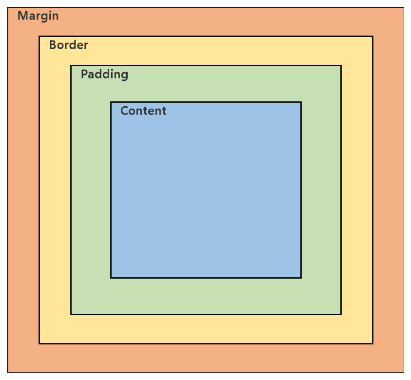

# Web HTML & CSS 정리

웹의 기본 구조를 이루는 **HTML**, 그리고 화면을 꾸미는 **CSS**의 기초 개념과 **Box Model**을 정리한 문서입니다.

---

## 1. 웹(Web)이란?

* **웹(World Wide Web):** 인터넷 상에서 하이퍼텍스트(하이퍼링크)로 서로 연결된 문서들의 시스템
* 웹 페이지가 브라우저에 표시되기까지의 기본 구성 요소
  * **HTML:** 문서의 구조와 의미를 정의 (뼈대)
  * **CSS:** 문서의 시각적 스타일을 정의 (외형)
  * **JavaScript:** 문서에 동적인 상호작용을 부여 (동작)

### 클라이언트 - 서버 구조

* 브라우저(클라이언트)가 서버에 HTML 문서를 요청(Request)하면, 서버가 응답(Response)으로 HTML/CSS/JS 파일을 전달하고 브라우저가 이를 해석해 화면에 렌더링

---

## 2. 웹 구조화 (HTML)

### HTML 기본 구조

```html
<!DOCTYPE html>
<html lang="ko">
<head>
    <meta charset="UTF-8">
    <title>페이지 제목</title>
</head>
<body>
    <h1>제목</h1>
    <p>문단 내용</p>
</body>
</html>
```

### 시맨틱(Semantic) 태그

* 단순히 화면 배치를 위한 `<div>`만 쓰는 대신, 의미가 담긴 태그를 사용하면 코드의 가독성과 접근성(스크린 리더 등)이 좋아짐

| 태그 | 의미 |
| --- | --- |
| `<header>` | 페이지/섹션의 머리말 |
| `<nav>` | 내비게이션(메뉴) 영역 |
| `<main>` | 문서의 핵심 콘텐츠 |
| `<section>` | 문서 내 독립적인 구획 |
| `<article>` | 독립적으로 배포/재사용 가능한 콘텐츠 (게시글 등) |
| `<footer>` | 페이지/섹션의 꼬리말 |

---

## 3. 웹 스타일링 (CSS)

### CSS 적용 방법

```html
<!-- 1) 인라인(inline): 요소에 직접 style 속성 -->
<p style="color: blue;">텍스트</p>

<!-- 2) 내부 스타일시트: <style> 태그 -->
<style> p { color: blue; } </style>

<!-- 3) 외부 스타일시트: 별도 .css 파일 연결 (유지보수에 가장 유리) -->
<link rel="stylesheet" href="style.css">
```

### 선택자(Selector)와 우선순위(Cascading)

```css
p { color: black; }              /* 태그 선택자 */
.highlight { color: red; }        /* 클래스 선택자 */
#title { color: blue; }            /* id 선택자 */
```

* CSS는 이름 그대로 **Cascading**(계단식) 방식으로 스타일이 적용되며, 우선순위는 대략 `인라인 > id > 클래스 > 태그` 순
* 같은 우선순위라면 **나중에 작성된 스타일**이 우선 적용됨

---

## 4. CSS Box Model

모든 HTML 요소는 사각형 박스로 취급되며, 이 박스는 안쪽에서 바깥쪽으로 4개의 영역으로 구성됩니다.



| 영역 | 설명 |
| --- | --- |
| **Content** | 실제 텍스트/이미지 등 내용이 표시되는 영역 |
| **Padding** | 내용과 테두리 사이의 여백 (요소의 배경색이 함께 적용됨) |
| **Border** | 요소를 감싸는 테두리 |
| **Margin** | 요소와 다른 요소 사이의 바깥 여백 (배경색 영향 없음) |

```css
.box {
    width: 200px;
    padding: 20px;
    border: 5px solid black;
    margin: 10px;
    box-sizing: border-box;   /* width에 padding, border까지 포함해서 계산 */
}
```

* 기본값(`box-sizing: content-box`)에서는 `width`가 Content 영역만을 의미해, padding/border를 더하면 실제 박스 크기가 커짐
* `box-sizing: border-box`로 설정하면 `width` 값이 Padding, Border까지 포함한 전체 박스 크기가 되어, 레이아웃 계산이 훨씬 직관적이 됨

---

## 핵심 요약
* 웹 페이지는 **HTML(구조) + CSS(스타일) + JavaScript(동작)** 3요소로 구성되며, 시맨틱 태그를 사용하면 문서의 의미와 접근성이 좋아진다.
* CSS는 인라인/내부/외부 스타일시트로 적용할 수 있고, 여러 스타일이 충돌할 때는 **선택자 우선순위와 작성 순서(Cascading)** 에 따라 최종 스타일이 결정된다.
* **Box Model**은 Content-Padding-Border-Margin의 4단 구조이며, `box-sizing: border-box`를 사용하면 `width`에 Padding/Border가 포함되어 레이아웃을 더 예측 가능하게 만들 수 있다.
