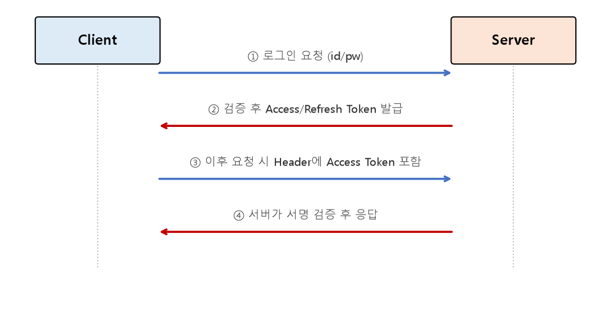

# 관통 PJT Vue를 활용한 AI Agent 기능 구현 정리

Vue 프론트엔드에서 **JWT(JSON Web Token)** 기반 인증을 처리하는 방법과, **위치 기반 지도 검색 기능**을 구현하는 방법을 정리한 문서입니다.

---

## 1. JWT (JSON Web Token)

### JWT란?

* 서버가 클라이언트의 로그인 상태를 **세션 저장 없이** 확인할 수 있도록 만든 토큰 기반 인증 방식
* `Header.Payload.Signature` 세 부분을 점(`.`)으로 이어붙인 문자열 구조를 가짐
  * **Header:** 토큰 타입과 서명 알고리즘 정보
  * **Payload:** 사용자 식별 정보 등 담고 싶은 데이터(Claim)
  * **Signature:** Header + Payload를 서버의 비밀키로 서명한 값 (변조 여부 검증용)

### 세션 방식과의 차이

| 구분 | 세션(Session) | JWT |
| --- | --- | --- |
| 로그인 정보 저장 위치 | 서버 (세션 저장소) | 클라이언트 (토큰 자체에 정보 포함) |
| 서버 확장성 | 서버 간 세션 공유 필요 | Stateless — 서버가 상태를 들고 있지 않아도 됨 |
| 토큰 만료 처리 | 서버에서 즉시 세션 삭제 가능 | Access Token은 만료 전까지 유효 (블랙리스트 등 별도 처리 필요) |

### Vue에서의 JWT 처리 흐름



```javascript
// 로그인 후 토큰 저장
const { data } = await axios.post("/api/login/", { username, password });
localStorage.setItem("access_token", data.access);
localStorage.setItem("refresh_token", data.refresh);

// 이후 모든 요청에 Access Token을 자동으로 포함 (axios interceptor)
axios.interceptors.request.use((config) => {
  const token = localStorage.getItem("access_token");
  if (token) {
    config.headers.Authorization = `Bearer ${token}`;
  }
  return config;
});
```

* Access Token은 탈취 위험을 줄이기 위해 **짧은 유효 기간**으로 발급하고, 만료 시 Refresh Token으로 재발급받는 구조가 일반적
* `localStorage`는 XSS 공격에 취약할 수 있어, 보안이 중요한 서비스에서는 `HttpOnly Cookie` 등 대안도 함께 고려

---

## 2. 위치 기반 지도 검색 기능 구현

### 지도 API 연동 기본 흐름

1. 지도 서비스(Kakao Map, Naver Map 등) SDK를 프로젝트에 로드
2. 사용자의 현재 위치(위도/경도) 획득
3. 지도 위에 마커(Marker)로 위치 표시
4. 키워드 검색 시, 검색 결과 좌표로 지도 중심 이동 및 마커 갱신

```javascript
// 브라우저의 Geolocation API로 현재 위치 가져오기
navigator.geolocation.getCurrentPosition((position) => {
  const { latitude, longitude } = position.coords;
  initMap(latitude, longitude);
});

// Vue 컴포넌트에서 지도 초기화 및 마커 표시
function initMap(lat, lng) {
  const map = new kakao.maps.Map(mapContainer.value, {
    center: new kakao.maps.LatLng(lat, lng),
    level: 3,
  });
  new kakao.maps.Marker({ position: map.getCenter(), map });
}
```

### 키워드 기반 장소 검색

```javascript
function searchPlaces(keyword) {
  const ps = new kakao.maps.services.Places();
  ps.keywordSearch(keyword, (data, status) => {
    if (status === kakao.maps.services.Status.OK) {
      data.forEach((place) => {
        new kakao.maps.Marker({
          position: new kakao.maps.LatLng(place.y, place.x),
          map,
        });
      });
    }
  });
}
```

### 백엔드와의 연동

* 검색된 장소 정보(좌표, 주소, 이름)를 Vue에서 Django API로 전달해 **찜하기/리뷰 남기기** 같은 부가 기능과 연결
* 위도/경도는 DB에 `FloatField` 또는 `PointField`(PostGIS 사용 시 공간 데이터 타입)로 저장해, 추후 "내 주변 N km 이내" 같은 위치 기반 쿼리로 확장 가능

---

## 핵심 요약
* **JWT**는 서버가 세션 상태를 들고 있지 않아도(Stateless) 되는 토큰 기반 인증 방식으로, Vue에서는 로그인 시 발급받은 토큰을 저장해두고 `axios interceptor`로 모든 요청에 자동으로 실어 보낸다.
* **위치 기반 지도 검색**은 Geolocation API로 현재 위치를 얻고, 지도 SDK(Kakao Map 등)로 마커를 표시하며, 키워드 검색 결과를 지도 위에 반영하는 흐름으로 구현한다.
* 검색된 위치 데이터를 백엔드 API와 연결하면, 찜하기/리뷰 등 위치 기반의 부가 기능으로 자연스럽게 확장할 수 있다.
