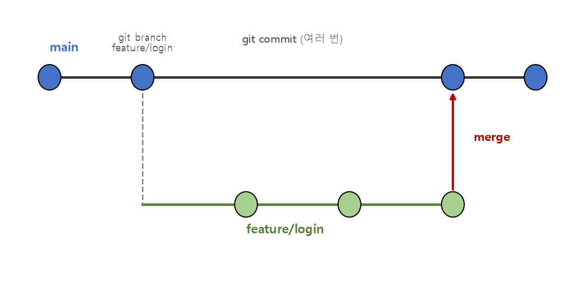

# 관통 PJT 프로젝트 기획과 협업 정리

여러 명이 함께 하나의 프로젝트를 진행할 때 필수적인 **Git Branch**, **Git Merge**, 그리고 팀 단위의 **Git Workflow(협업 전략)** 를 정리한 문서입니다.

---

## 1. Git Branch

* **브랜치(Branch):** 독립적으로 작업할 수 있는 커밋 흐름의 한 줄기. `main`(또는 `master`) 브랜치에서 갈라져 나와, 다른 브랜치의 작업에 영향을 주지 않고 새 기능을 개발할 수 있음
* 여러 명이 동시에 각자의 기능을 개발할 때, 브랜치를 분리해두면 서로의 작업이 완성되기 전까지 `main` 브랜치를 안전하게 보호할 수 있음

```bash
git branch feature/login        # 새 브랜치 생성
git checkout feature/login       # 브랜치로 이동
git checkout -b feature/login    # 생성 + 이동을 한 번에

git branch                        # 로컬 브랜치 목록 확인
git branch -d feature/login       # 브랜치 삭제 (병합 완료된 브랜치만 안전하게 삭제)
```

---

## 2. Git Merge

* **병합(Merge):** 서로 다른 브랜치에서 진행된 작업 내용을 하나의 브랜치로 합치는 작업

```bash
git checkout main
git merge feature/login    # feature/login의 변경 사항을 main으로 병합
```



### 병합 방식

| 방식 | 설명 |
| --- | --- |
| **Fast-forward** | `main`에 그 사이 다른 커밋이 없을 때, 브랜치 포인터만 앞으로 이동시켜 병합 |
| **3-way merge (Merge Commit)** | 두 브랜치가 각각 다른 커밋을 가지고 있을 때, 새로운 병합 커밋을 만들어 두 흐름을 합침 |

### 충돌(Conflict)

* 두 브랜치가 **같은 파일의 같은 부분**을 서로 다르게 수정했을 때 발생
* Git이 자동으로 병합하지 못하고 충돌 표시(`<<<<<<<`, `=======`, `>>>>>>>`)를 남기면, 직접 코드를 확인해 원하는 형태로 수정한 뒤 다시 커밋해야 함

```bash
git status                 # 충돌난 파일 확인
# 파일을 열어 충돌 부분을 직접 수정
git add <충돌 해결한 파일>
git commit                 # 병합 커밋 완료
```

---

## 3. Git Workflow (협업 전략)

### 브랜치 전략의 필요성

* 팀 인원이 늘어날수록, 브랜치를 어떻게 만들고 언제 병합할지에 대한 **규칙(Workflow)** 이 없으면 충돌과 혼란이 잦아짐

### 대표적인 브랜치 전략 예시

* **main / develop / feature 구조**
  * `main`: 배포 가능한 안정적인 코드만 유지
  * `develop`: 다음 배포를 위해 여러 기능이 통합되는 브랜치
  * `feature/*`: 개별 기능 개발용 브랜치, 완료되면 `develop`으로 병합(PR)
* **Pull Request(PR) 기반 협업**
  1. `feature` 브랜치에서 기능 개발 후 원격 저장소에 push
  2. `develop`(또는 `main`)으로의 Pull Request 생성
  3. 팀원 코드 리뷰 → 승인 후 병합
  4. 병합 완료된 `feature` 브랜치는 삭제

### 협업 시 권장 원칙

* 커밋 메시지는 **무엇을, 왜** 변경했는지 명확히 작성
* 하나의 브랜치/커밋은 가능한 **하나의 작업 단위**로 좁게 유지 (리뷰와 롤백이 쉬워짐)
* `main`에는 항상 정상 동작하는 코드만 유지 (직접 커밋 대신 PR을 통한 병합을 원칙으로)

---

## 핵심 요약
* **Git Branch**는 `main`으로부터 독립된 작업 흐름을 만들어, 여러 사람이 서로의 작업에 영향을 주지 않고 동시에 개발할 수 있게 해준다.
* **Git Merge**는 브랜치의 작업을 다시 합치는 과정으로, 상황에 따라 Fast-forward 또는 병합 커밋 방식으로 이루어지며 같은 부분을 다르게 수정했을 때 충돌이 발생할 수 있다.
* 팀 프로젝트에서는 `main`/`develop`/`feature` 같은 **브랜치 전략**과 **Pull Request 기반 코드 리뷰**를 통해 안정적으로 협업하는 것이 중요하다.
